# Yazılım Geliştirme Laboratuvarı-II

## From Black-Box to Explainability: Probabilistic Automata for Time Series Anomaly Detection

**Ders:** Yazılım Geliştirme Laboratuvarı-II  
**Dönem:** 2025-2026 Bahar Dönemi  

| Ad Soyad | Öğrenci No |
|---|---|
| Muhammed Ali Derindağ | 231307053 |
| İrem Kalaycı | 231307047 |

---

## İçindekiler

- [1. Proje Tanımı ve Motivasyon](#1-proje-tanımı-ve-motivasyon)
- [2. Araştırma Problemi ve Amaç](#2-araştırma-problemi-ve-amaç)
- [3. Veri Setleri](#3-veri-setleri)
- [4. Veri Ön İşleme](#4-veri-ön-işleme)
- [5. Deneysel Bölme Protokolü](#5-deneysel-bölme-protokolü)
- [6. Modelleme Yaklaşımları](#6-modelleme-yaklaşımları)
- [7. Unseen Pattern Yönetimi](#7-unseen-pattern-yönetimi)
- [8. Açıklanabilirlik Analizi](#8-açıklanabilirlik-analizi)
- [9. Deney Senaryoları](#9-deney-senaryoları)
- [10. Deney Sonuçları ve Karşılaştırmalı Analiz](#10-deney-sonuçları-ve-karşılaştırmalı-analiz)
- [11. Görsel Analizler](#11-görsel-analizler)
- [12. Proje Çıktıları](#12-proje-çıktıları)
- [13. Projeyi Çalıştırma](#13-projeyi-çalıştırma)
- [14. Sonuç](#14-sonuç)

---

## 1. Proje Tanımı ve Motivasyon

Bu projede zaman serisi verileri üzerinde anomali tespiti problemi ele alınmıştır. Çalışmanın temel amacı, yüksek performans potansiyeline sahip ancak yorumlanabilirliği sınırlı derin öğrenme tabanlı black-box modeller ile sembolik temsil ve durum geçişlerine dayalı yorumlanabilir otomata tabanlı modelleri karşılaştırmaktır.

Zaman serisi verileri finansal sistemler, endüstriyel kontrol sistemleri, IoT altyapıları, biyomedikal sinyaller ve davranışsal analiz uygulamaları gibi birçok alanda kullanılmaktadır. Bu tür verilerde anomali tespiti, sistem güvenliği ve erken uyarı mekanizmaları açısından kritik öneme sahiptir.

Bu proje kapsamında modeller yalnızca accuracy veya F1-score gibi performans metrikleriyle değil, aynı zamanda aşağıdaki kriterlere göre de analiz edilmiştir:

- Genellenebilirlik
- Gürültüye dayanıklılık
- Unseen pattern davranışı
- Açıklanabilirlik
- Çalışma süresi
- Parametre duyarlılığı
- İstatistiksel anlamlılık

Bu çalışmanın amacı tek bir en iyi modeli seçmek değil, farklı modelleme yaklaşımlarının farklı veri koşulları altında nasıl davrandığını bilimsel ve sistematik biçimde analiz etmektir.

---

## 2. Araştırma Problemi ve Amaç

Bu çalışmada aşağıdaki temel araştırma problemi ele alınmıştır:

> Farklı modelleme yaklaşımları, zaman serisi verileri üzerinde farklı veri koşulları altında nasıl davranmaktadır ve bu davranışlar istatistiksel olarak anlamlı mıdır?

Bu kapsamda proje aşağıdaki hedefleri içermektedir:

- Derin öğrenme ve otomata tabanlı modellerin karşılaştırmalı analizi
- Model performansının veri setine bağlılığının incelenmesi
- Gürültü eklenmiş veri altında model davranışının değerlendirilmesi
- Unseen pattern durumunda model davranışının analiz edilmesi
- Açıklanabilirlik açısından model çıktılarının yorumlanması
- Parametre değişimlerinin performans, state sayısı ve transition density üzerindeki etkilerinin incelenmesi
- Eğitim ve inference sürelerinin karşılaştırılması
- Model davranışlarının istatistiksel olarak değerlendirilmesi

---

## 3. Veri Setleri

Bu projede iki farklı zaman serisi veri seti kullanılmıştır:

- SKAB
- BATADAL

---

### 3.1 SKAB Veri Seti Kullanımı

SKAB veri setinde yalnızca `valve1` ve `valve2` klasörleri kullanılmıştır. Bu iki klasörde bulunan tüm `.csv` dosyaları birleştirilerek tek bir veri seti oluşturulmuştur.

Birleştirme sırasında aşağıdaki metadata sütunları eklenmiştir:

| Sütun | Açıklama |
|---|---|
| `source_group` | Kaydın `valve1` veya `valve2` klasöründen geldiğini gösterir. |
| `source_file` | Kaydın hangi `.csv` dosyasından geldiğini gösterir. |

Bu sütunlar model girdisi olarak kullanılmamıştır. Yalnızca veri takibi, dosya bazlı veri bölme ve sonuç analizi amacıyla kullanılmıştır.

SKAB veri setinde hedef değişken: `anomaly`

Model girdisine dahil edilmeyen sütunlar: `datetime`, `changepoint`, `source_group`, `source_file`

Model girdisi olarak yalnızca sensör değişkenleri kullanılmıştır.

---

### 3.2 BATADAL Veri Seti Kullanımı

BATADAL veri setinde yalnızca **Training Dataset 2** kullanılmıştır. Training Dataset 1 yalnızca normal operasyon verisi içerdiği için supervised sınıflandırma amacıyla kullanılmamıştır. Test Dataset ise etiket bilgisi içermediği için performans değerlendirmesinde kullanılmamıştır.

BATADAL veri setinde hedef değişken: `ATT_FLAG`

Zaman bilgisini içeren sütunlar model girdisine dahil edilmemiştir. Bu sütunlar yalnızca zaman sırasının korunması, veri bölme ve sonuçların zamansal olarak yorumlanması amacıyla değerlendirilmiştir.

---

## 4. Veri Ön İşleme

Veri ön işleme süreci aşağıdaki adımlardan oluşmaktadır:

1. Eksik veri kontrolü ve gerekli dönüşümler
2. Normalizasyon
3. PCA ile boyut indirgeme
4. Automata modeli için PC1 bileşeninin kullanılması

Çok değişkenli zaman serileri, otomata modelinin tek boyutlu çalışması nedeniyle PCA ile tek boyuta indirgenmiştir. İlk temel bileşen olan PC1, sembolik dönüşüm ve otomata modelleme aşamalarında kullanılmıştır.

---

### 4.1 Data Leakage Önleme

Veri sızıntısını önlemek için aşağıdaki kurallar uygulanmıştır:

| Kural | Uygulama |
|---|---|
| Normalizasyon yalnızca train verisine fit edilir. | Validation ve test verilerine aynı scaler uygulanmıştır. |
| PCA yalnızca train verisine fit edilir. | Validation ve test verileri aynı PCA modeliyle dönüştürülmüştür. |
| SAX/PAA sözlüğü yalnızca train verisinden oluşturulur. | Test verisi otomata geçiş olasılıklarını öğrenmek için kullanılmamıştır. |
| Otomata transition probability yalnızca train verisiyle hesaplanır. | Test verisi yalnızca değerlendirme için kullanılmıştır. |
| Random row split yapılmaz. | Zaman serisi bağımlılığı ve deney bütünlüğü korunmuştur. |

---

## 5. Deneysel Bölme Protokolü

### 5.1 SKAB Bölme Stratejisi

SKAB veri setinde satır bazlı rastgele bölme yapılmamıştır. Bunun yerine `source_file` sütunu grup değişkeni olarak kullanılmış ve GroupKFold uygulanmıştır.

Bu sayede aynı `.csv` dosyasına ait kayıtların hem train hem test kümesinde aynı anda bulunması engellenmiştir.

SKAB için temel bölme yaklaşımı:

| Özellik | Uygulama |
|---|---|
| Grup değişkeni | `source_file` |
| Split yöntemi | GroupKFold |
| Amaç | Aynı dosyanın train ve testte birlikte bulunmasını engellemek |
| Raporlama | Fold ortalaması ve standart sapması |

---

### 5.2 BATADAL Bölme Stratejisi

BATADAL veri setinde zaman sırası korunmuştur. Rastgele satır bazlı bölme yapılmamıştır.

Kronolojik bölme oranları:

| Split | Oran |
|---|---:|
| Train | %60 |
| Validation | %20 |
| Test | %20 |

Bu oranlar proje isterlerine uygun olarak sabit tutulmuştur.

---

## 6. Modelleme Yaklaşımları

Bu projede iki farklı modelleme paradigması karşılaştırılmıştır:

1. Derin öğrenme tabanlı black-box modeller
2. Yorumlanabilir otomata tabanlı model

---

### 6.1 Derin Öğrenme Modelleri

Projede aşağıdaki iki derin öğrenme modeli uygulanmıştır:

- LSTM Autoencoder
- 1D-CNN Autoencoder

Bu modeller reconstruction error tabanlı anomali tespiti yapmaktadır. Model, normal zaman serisi örüntülerini yeniden üretmeyi öğrenir. Test aşamasında reconstruction error yüksek olan örnekler anomali adayı olarak değerlendirilir.

Dinamik threshold, train reconstruction error skorlarının belirli percentile değerine göre hesaplanmıştır.

Model eğitim parametreleri:

| Parametre | Değer |
|---|---:|
| Epoch üst sınırı | 50 |
| Batch size | 32 |
| Early stopping | Validation loss |
| Patience | 5 |
| Random seed değerleri | 42, 123, 2026, 7, 999 |
| Threshold percentile | 95 |

Early stopping kullanıldığı için modeller her zaman 50 epoch tamamlamamıştır. Validation loss 5 epoch boyunca iyileşmediğinde eğitim durdurulmuş ve en iyi validation loss değerine sahip checkpoint geri yüklenmiştir.

Bu nedenle deney loglarında bazı modellerin 50 epoch tamamlamadan durması hata değil, beklenen early stopping davranışıdır.

---

### 6.2 Otomata Tabanlı Model

Otomata modeli aşağıdaki dönüşümler üzerinden kurulmuştur:

1. PAA, Piecewise Aggregate Approximation
2. SAX, Symbolic Aggregate approXimation
3. Sliding Window ile pattern çıkarımı

Her benzersiz pattern bir state olarak tanımlanmıştır. Ardışık pattern geçişlerinden transition count değerleri çıkarılmış ve bu değerler normalize edilerek geçiş olasılıkları hesaplanmıştır.

Geçiş olasılığı aşağıdaki şekilde hesaplanmıştır:

`P(S_i -> S_j) = count(S_i -> S_j) / total_outgoing_count(S_i)`

Düşük olasılıklı geçişler anomaly adayı olarak değerlendirilmiştir.

Sabit karşılaştırma parametreleri:

| Parametre | Değer |
|---|---:|
| Window size | 4 |
| Alphabet size | 3 |

Parametre varyasyonunda denenen değerler:

| Parametre | Değerler |
|---|---|
| Window size | 3, 4, 5, 6 |
| Alphabet size | 3, 4, 5, 6 |

---

## 7. Unseen Pattern Yönetimi

Test aşamasında eğitim sırasında görülmemiş pattern değerleri ile karşılaşılması durumunda unseen pattern yönetimi uygulanmıştır.

Unseen veri şu şekilde tanımlanmıştır:

1. Eğitim verisinden elde edilen SAX sözlüğü çıkarılır.
2. Test sırasında bu sözlükte bulunmayan pattern değerleri unseen olarak kabul edilir.

Unseen pattern tespit edildiğinde:

1. Levenshtein Edit Distance hesaplanır.
2. Testte görülen unseen pattern'a en yakın train pattern bulunur.
3. Sistem bu en yakın state üzerinden devam eder.
4. Bu işlem explainability çıktısında `mapped_to` ve `edit_distance` alanlarıyla raporlanır.

Bu mekanizma birim testlerle doğrulanmıştır.

---

## 8. Açıklanabilirlik Analizi

Otomata tabanlı model, her test adımı için JSON formatında açıklama üretmektedir. Açıklama çıktıları modelin iç hesaplamalarıyla tutarlı olacak şekilde transition probability, confidence score ve karar gerekçesi içermektedir.

Her step için üretilen alanlar:

| Alan | Açıklama |
|---|---|
| `time_step` | Test dizisindeki adım |
| `previous_state` | Önceki resolved state |
| `state` | Mevcut resolved state |
| `pattern` | Gelen pattern |
| `status` | `seen` veya `unseen` |
| `mapped_to` | Unseen ise en yakın pattern |
| `edit_distance` | En yakın pattern ile edit distance |
| `transition` | Geçiş bilgisi |
| `probability` | Geçiş olasılığı |
| `confidence_score` | Karar güven skoru |
| `confidence_level` | `low` veya `high` |
| `path_probability_so_far` | O ana kadarki path probability |
| `threshold` | Anomali eşiği |
| `decision` | `normal` veya `anomaly` |
| `reason` | Kararın olasılıksal açıklaması |

Örnek açıklama çıktısı:

    {
      "time_step": 1,
      "previous_state": "cccc",
      "state": "cccc",
      "pattern": "cccc",
      "status": "seen",
      "mapped_to": null,
      "edit_distance": 0,
      "transition": {
        "from": "cccc",
        "to": "cccc",
        "probability": 0.9977
      },
      "probability": 0.9977,
      "confidence_score": 0.9977,
      "confidence_level": "high",
      "decision": "normal",
      "reason": "Transition probability is greater than or equal to the anomaly threshold."
    }

Açıklanabilirlik çıktıları aşağıdaki dosyalarda tutulmaktadır:

- `results/skab_fold*_explainability.json`
- `results/batadal_fold0_explainability.json`

---

## 9. Deney Senaryoları

Deneyler üç ana senaryo altında yürütülmüştür:

| Senaryo | Açıklama |
|---|---|
| Orijinal veri | Modeller orijinal test verisi üzerinde değerlendirilmiştir. |
| Gaussian noise | Veriye farklı standart sapmalarda Gaussian noise eklenerek robustness analizi yapılmıştır. |
| Unseen veri | Eğitim SAX sözlüğünde bulunmayan test pattern değerleri analiz edilmiştir. |

Gaussian noise deneylerinde kullanılan standart sapma değerleri:

- 0.05
- 0.1
- 0.2
- 0.5

---

## 10. Deney Sonuçları ve Karşılaştırmalı Analiz

Bu bölümde derin öğrenme modelleri, otomata tabanlı model, gürültü etkisi, unseen pattern davranışı, cross-dataset genellenebilirlik, parametre duyarlılığı, runtime ve istatistiksel anlamlılık sonuçları birlikte değerlendirilmiştir.

---

### 10.1 Model Performansı ve Stabilitesi

Aşağıdaki tablo, modellerin SKAB ve BATADAL veri setleri üzerindeki ortalama performanslarını göstermektedir. Derin öğrenme modelleri 5 farklı random seed ile çalıştırılmıştır. SKAB için sonuçlar 5 fold üzerinden, BATADAL için ise kronolojik test split'i üzerinden raporlanmıştır.

| Dataset | Model | Accuracy Mean | Accuracy Std | F1 Mean | F1 Std |
|---|---|---:|---:|---:|---:|
| BATADAL | 1D-CNN | 0.7536 | 0.0373 | 0.6276 | 0.0313 |
| BATADAL | LSTM | 0.6630 | 0.0153 | 0.2197 | 0.0746 |
| BATADAL | Automata | 0.8354 | 0.0000 | 0.2703 | 0.0000 |
| SKAB | 1D-CNN | 0.5384 | 0.0181 | 0.0843 | 0.1447 |
| SKAB | LSTM | 0.5266 | 0.0601 | 0.1409 | 0.1672 |
| SKAB | Automata | 0.6310 | 0.0000 | 0.0236 | 0.0000 |

BATADAL veri setinde en yüksek F1-score değeri 1D-CNN modeli tarafından elde edilmiştir. Automata modeli BATADAL üzerinde en yüksek accuracy değerine sahip olsa da F1-score açısından 1D-CNN modelinin gerisinde kalmıştır. Bu durum, accuracy değerinin sınıf dengesizliği bulunan anomali tespiti problemlerinde tek başına yeterli olmadığını göstermektedir.

SKAB veri setinde LSTM modeli, 1D-CNN ve automata modeline göre daha yüksek F1-score üretmiştir. Ancak SKAB üzerinde tüm modellerin F1-score değerleri BATADAL'a göre daha düşüktür. Bunun temel nedenleri arasında dosya bazlı GroupKFold ayrımı, veri setinin fold bazlı dağılım farklılıkları ve anomalilerin daha zor ayrıştırılması yer almaktadır.

---

### 10.2 Veri Setleri Arası Performans Farkları

Model performansları veri setine göre belirgin biçimde değişmiştir. BATADAL üzerinde 1D-CNN modeli yüksek F1-score değerine ulaşırken, SKAB üzerinde aynı model oldukça düşük F1-score üretmiştir.

| Dataset | En Yüksek F1 Veren Model | En Yüksek F1 |
|---|---|---:|
| BATADAL | 1D-CNN | 0.6276 |
| SKAB | LSTM | 0.1409 |

BATADAL veri setinde 1D-CNN modelinin yüksek performans göstermesi, reconstruction error tabanlı CNN yaklaşımının bu veri setindeki anomali örüntülerini daha iyi ayırt ettiğini göstermektedir.

SKAB veri setinde ise daha düşük F1-score değerleri elde edilmiştir. Bu sonuç, SKAB veri setinin kullanılan split protokolü altında daha zorlayıcı olduğunu göstermektedir. Özellikle aynı `source_file` değerine sahip kayıtların train ve test kümelerine birlikte girmesinin engellenmesi, veri sızıntısını önlemiş ancak görevi daha zor hale getirmiştir.

Bu nedenle SKAB sonuçlarının düşük olması doğrudan modelin hatalı çalıştığı anlamına gelmemektedir. Aksine, rastgele satır bazlı bölme yapılmadığı için daha gerçekçi ve daha zor bir değerlendirme protokolü uygulanmıştır.

---

### 10.3 Gürültü Etkisi Analizi

Gaussian noise eklenmiş veriler üzerinde automata modelinin dayanıklılığı test edilmiştir. Aşağıdaki tablo, orijinal veri ve farklı standart sapmalarda gürültü eklenmiş veri üzerindeki F1-score değerlerini göstermektedir.

| Dataset | Original F1 | Noise 0.05 F1 | Noise 0.1 F1 | Noise 0.2 F1 | Noise 0.5 F1 |
|---|---:|---:|---:|---:|---:|
| SKAB | 0.0236 | 0.0689 | 0.1267 | 0.1979 | 0.3059 |
| BATADAL | 0.2703 | 0.2778 | 0.2778 | 0.4186 | 0.3043 |

SKAB veri setinde noise seviyesi arttıkça F1-score değerinin yükseldiği görülmüştür. Bu durum, noise eklenmesinin bazı düşük olasılıklı geçişleri daha belirgin hale getirmiş olabileceğini düşündürmektedir.

BATADAL veri setinde ise en yüksek F1-score değeri 0.2 noise seviyesinde elde edilmiştir. Ancak 0.5 noise seviyesinde performans düşmüştür. Bu durum, orta seviyedeki gürültünün bazı ayrımları belirginleştirebildiğini, ancak yüksek gürültünün veri yapısını bozarak performansı düşürebildiğini göstermektedir.

---

### 10.4 Unseen Veri Davranışı

Unseen pattern analizi, gerçek explainability çıktıları üzerinden yapılmıştır. Unseen pattern, test sırasında eğitim SAX sözlüğünde bulunmayan pattern olarak tanımlanmıştır.

| Dataset | Fold | Total Steps | Unseen Count | Unseen Rate | Mapped Unseen Rate | Mean Edit Distance | Unseen Anomaly Rate |
|---|---:|---:|---:|---:|---:|---:|---:|
| BATADAL | 0 | 164 | 0 | 0.0000 | 0.0000 | 0.0000 | 0.0000 |
| SKAB | 0 | 899 | 1 | 0.0011 | 1.0000 | 1.0000 | 1.0000 |
| SKAB | 1 | 895 | 0 | 0.0000 | 0.0000 | 0.0000 | 0.0000 |
| SKAB | 2 | 895 | 2 | 0.0022 | 1.0000 | 1.0000 | 1.0000 |
| SKAB | 3 | 883 | 3 | 0.0034 | 1.0000 | 1.0000 | 0.6667 |
| SKAB | 4 | 905 | 6 | 0.0066 | 1.0000 | 1.0000 | 0.3333 |

BATADAL test setinde unseen pattern gözlemlenmemiştir. SKAB veri setinde ise bazı foldlarda düşük oranda unseen pattern oluşmuştur. Tüm unseen pattern'ların Levenshtein edit distance kullanılarak en yakın state'e başarıyla map edildiği görülmektedir.

SKAB foldlarında `mapped_unseen_rate` değerinin 1.0 olması, unseen pattern yönetim mekanizmasının test sırasında çalıştığını göstermektedir. Ortalama edit distance değerinin 1.0 olması, unseen pattern'ların eğitim sözlüğündeki en yakın pattern'lardan yalnızca küçük sembolik farklarla ayrıldığını göstermektedir.

---

### 10.5 Cross-Dataset Genellenebilirlik

Cross-dataset deneylerinde automata modeli bir veri setinde eğitilip diğer veri setinde test edilmiştir.

| Train Dataset | Test Dataset | Accuracy | Precision | Recall | F1 |
|---|---|---:|---:|---:|---:|
| SKAB | SKAB | 0.6301 | 0.3333 | 0.0104 | 0.0201 |
| SKAB | BATADAL | 0.3963 | 0.1275 | 0.5652 | 0.2080 |
| BATADAL | SKAB | 0.3713 | 0.3668 | 0.9836 | 0.5343 |
| BATADAL | BATADAL | 0.8354 | 0.3571 | 0.2174 | 0.2703 |

BATADAL üzerinde eğitilip SKAB üzerinde test edilen modelin F1-score değeri 0.5343 olarak ölçülmüştür. Bu sonuç, BATADAL üzerinde öğrenilen bazı geçiş yapılarının SKAB test senaryosunda anomalileri yakalama açısından daha duyarlı davranabildiğini göstermektedir.

Buna karşın SKAB üzerinde eğitilip BATADAL üzerinde test edilen modelin F1-score değeri 0.2080 seviyesinde kalmıştır. Bu durum, modelin öğrendiği sembolik geçiş yapılarının veri setine bağlı olduğunu ve cross-dataset genellenebilirliğin simetrik olmadığını göstermektedir.

---

### 10.6 Automata Parametre Duyarlılık Analizi

Bu bölümde window size ve alphabet size parametrelerinin model performansı, state count ve transition density üzerindeki etkileri analiz edilmiştir.

#### SKAB için Seçilmiş Parametre Sonuçları

| Window Size | Alphabet Size | Accuracy | F1 | State Count | Transition Density |
|---:|---:|---:|---:|---:|---:|
| 3 | 3 | 0.6356 | 0.0192 | 15.6 | 0.1197 |
| 4 | 3 | 0.6310 | 0.0236 | 29.2 | 0.0549 |
| 4 | 6 | 0.5819 | 0.1599 | 64.4 | 0.0253 |
| 5 | 6 | 0.5783 | 0.1703 | 103.0 | 0.0141 |
| 6 | 6 | 0.5729 | 0.1774 | 146.6 | 0.0090 |

#### BATADAL için Seçilmiş Parametre Sonuçları

| Window Size | Alphabet Size | Accuracy | F1 | State Count | Transition Density |
|---:|---:|---:|---:|---:|---:|
| 3 | 3 | 0.8727 | 0.0000 | 26.0 | 0.1006 |
| 4 | 3 | 0.8354 | 0.2703 | 68.0 | 0.0279 |
| 4 | 6 | 0.5183 | 0.3009 | 316.0 | 0.0042 |
| 5 | 5 | 0.4908 | 0.2655 | 364.0 | 0.0033 |
| 6 | 6 | 0.4136 | 0.2857 | 470.0 | 0.0022 |

Parametre analizi, window size ve alphabet size arttıkça state count değerinin yükseldiğini, transition density değerinin ise düştüğünü göstermektedir. Bu beklenen bir davranıştır; çünkü sembolik uzay büyüdükçe daha fazla state oluşmakta, ancak geçişler daha seyrek hale gelmektedir.

SKAB veri setinde daha büyük alphabet size değerleri F1-score değerini artırma eğilimi göstermiştir. BATADAL veri setinde ise en yüksek F1-score değerlerinden biri `window_size=4, alphabet_size=6` kombinasyonunda elde edilmiştir.

---

### 10.7 Runtime Karşılaştırması

Aşağıdaki tablo, modellerin ortalama eğitim ve inference sürelerini göstermektedir.

| Dataset | Model | Training Time Mean, sec | Training Time Std | Inference Time Mean, sec | Accuracy Mean | F1 Mean |
|---|---|---:|---:|---:|---:|---:|
| SKAB | Automata | 0.3648 | 0.0000 | 0.0000 | 0.6310 | 0.0236 |
| BATADAL | Automata | 0.0403 | 0.0000 | 0.0000 | 0.8354 | 0.2703 |
| BATADAL | 1D-CNN | 86.8981 | 17.8485 | 0.6147 | 0.7536 | 0.6276 |
| BATADAL | LSTM | 242.6546 | 64.5634 | 1.0070 | 0.6630 | 0.2197 |
| SKAB | 1D-CNN | 164.8927 | 101.9135 | 2.2889 | 0.5384 | 0.0843 |
| SKAB | LSTM | 518.9486 | 221.3806 | 7.6417 | 0.5266 | 0.1409 |

Runtime sonuçları, automata tabanlı modelin derin öğrenme modellerine göre çok daha düşük eğitim süresine sahip olduğunu göstermektedir. LSTM modeli özellikle SKAB üzerinde en yüksek eğitim süresine sahiptir. 1D-CNN modeli ise LSTM'e göre daha kısa sürede eğitilmiş ve BATADAL üzerinde daha yüksek F1-score üretmiştir.

Bu sonuçlar, performans ve çalışma süresi arasında modelden modele değişen bir trade-off olduğunu göstermektedir.

---

### 10.8 İstatistiksel Anlamlılık Testleri

Model davranışlarının istatistiksel olarak anlamlı olup olmadığını değerlendirmek için paired sonuçlar üzerinde Wilcoxon signed-rank testi uygulanmıştır.

| Dataset | Model A | Model B | Pairing Key | N Pairs | Statistic | P-value | Significant at 0.05 |
|---|---|---|---|---:|---:|---:|---|
| SKAB | LSTM | 1D-CNN | dataset+seed+fold | 25 | 38.0 | 0.1208 | False |
| SKAB | Automata | 1D-CNN | dataset+seed | 5 | 0.0 | 0.0625 | False |
| SKAB | Automata | LSTM | dataset+seed | 5 | 0.0 | 0.0625 | False |
| BATADAL | LSTM | 1D-CNN | dataset+seed+fold | 5 | 0.0 | 0.0625 | False |
| BATADAL | Automata | 1D-CNN | dataset+seed | 5 | 0.0 | 0.0625 | False |
| BATADAL | Automata | LSTM | dataset+seed | 5 | 3.0 | 0.3125 | False |

Wilcoxon signed-rank test sonuçlarına göre model çiftleri arasındaki performans farkları 0.05 anlamlılık düzeyinde istatistiksel olarak anlamlı bulunmamıştır. Ancak ortalama F1-score değerleri, modellerin veri setlerine göre farklı davranışlar sergilediğini göstermektedir.

Özellikle BATADAL üzerinde 1D-CNN modelinin ortalama F1-score değeri diğer modellere göre daha yüksektir. SKAB üzerinde ise LSTM modeli daha yüksek ortalama F1-score üretmiştir. Bu sonuçlar, istatistiksel anlamlılık bulunmasa bile model davranışlarının veri setine bağlı olarak değiştiğini göstermektedir.

---

## 11. Görsel Analizler

### 11.1 Confusion Matrix

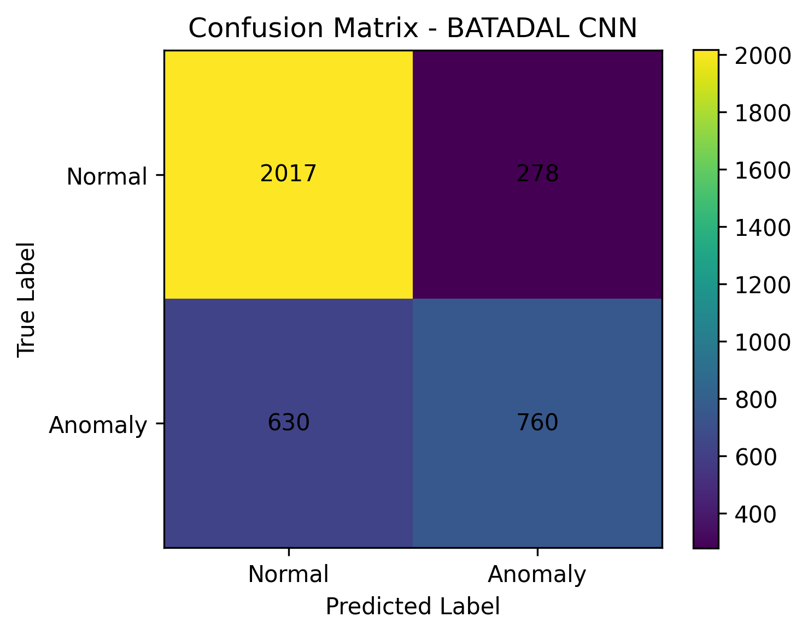

### 11.2 Precision-Recall Eğrisi

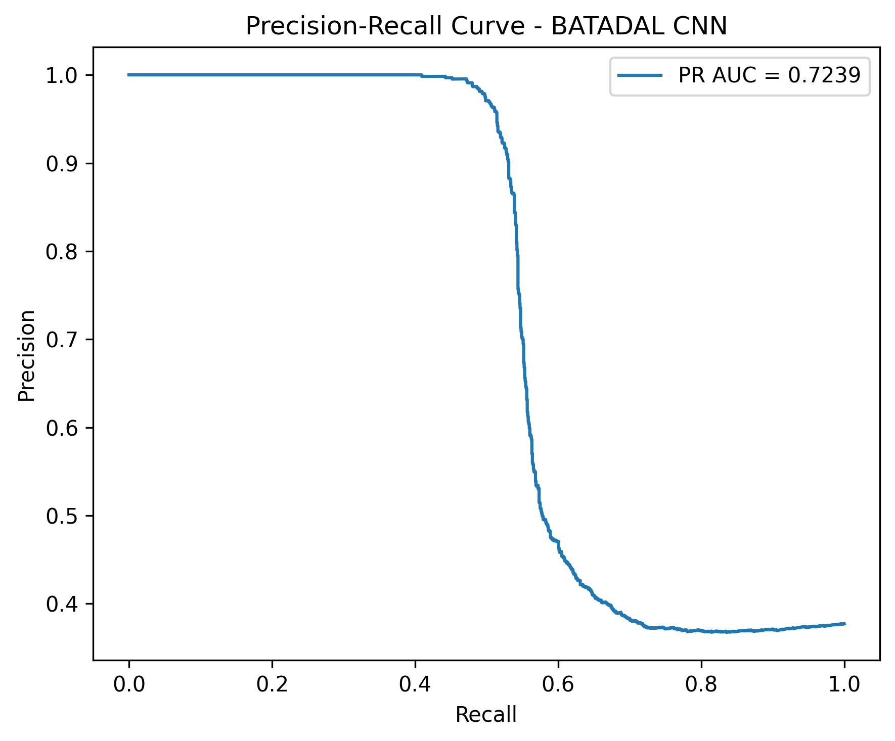

### 11.3 Automata State Diagram

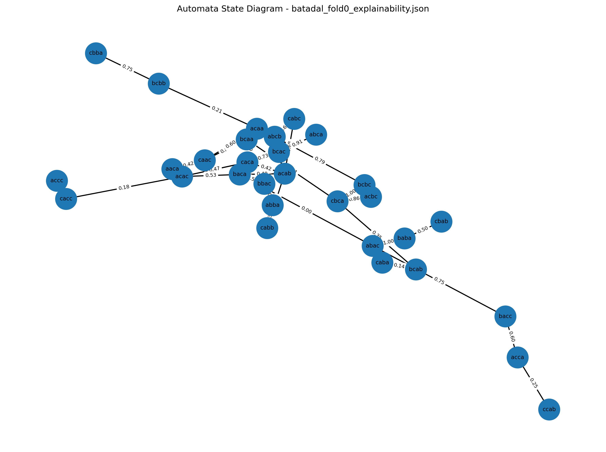

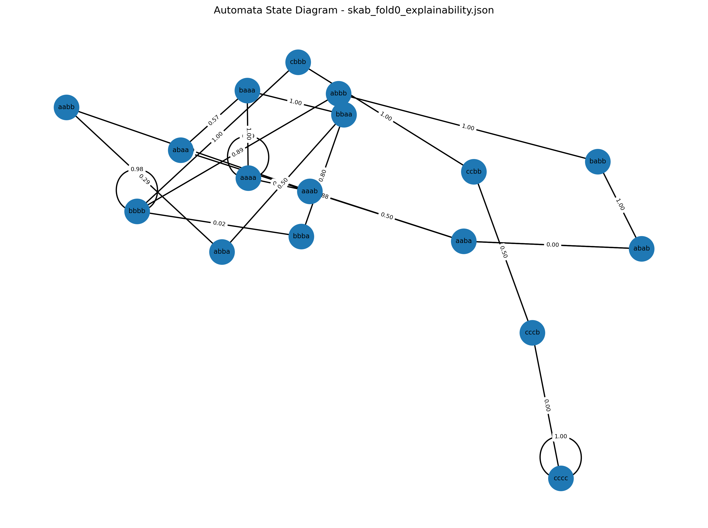

### 11.4 Transition Probability Heatmap

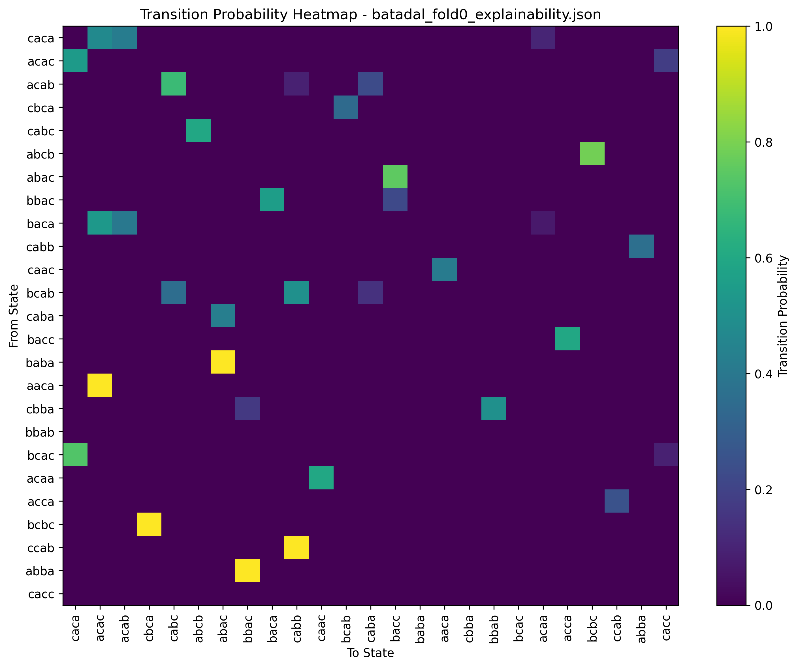

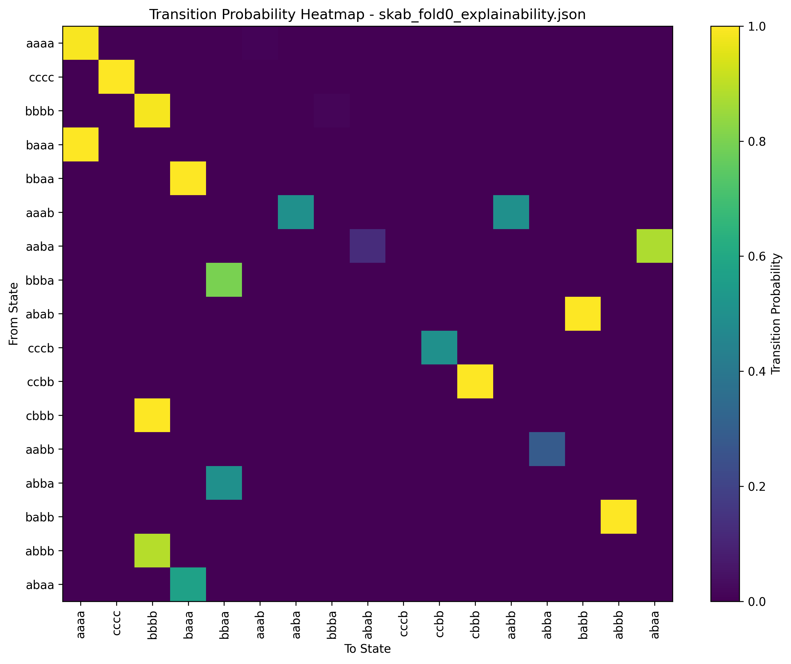

### 11.5 Parametre Duyarlılık Grafikleri

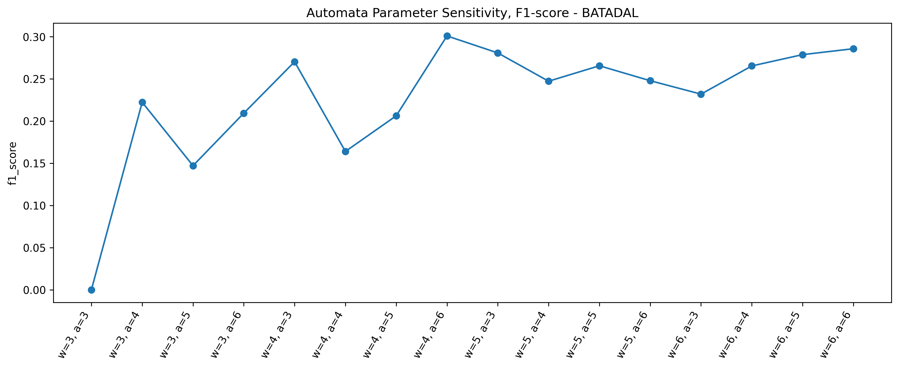

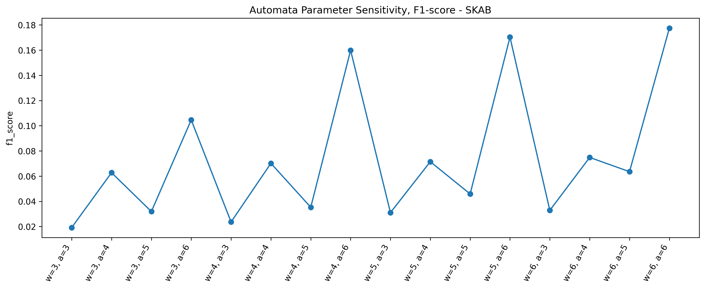

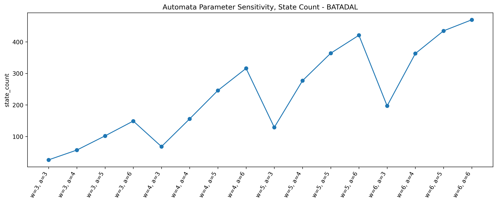

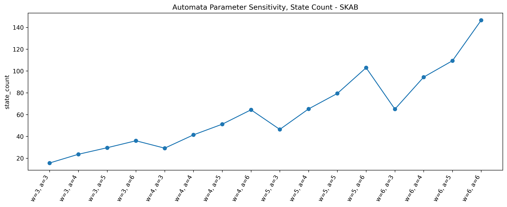

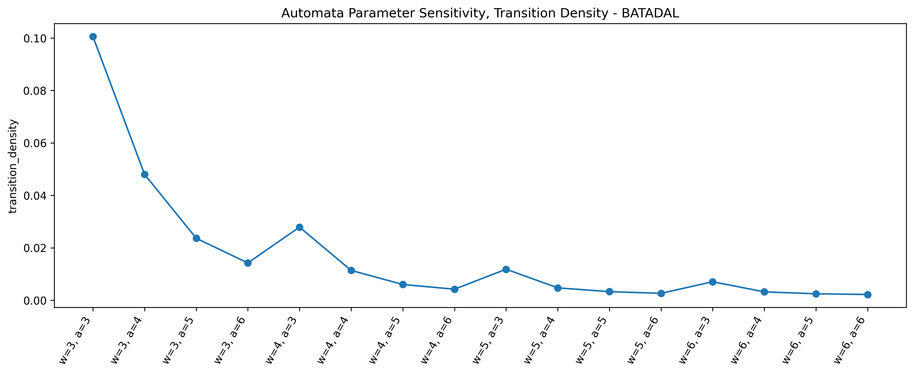

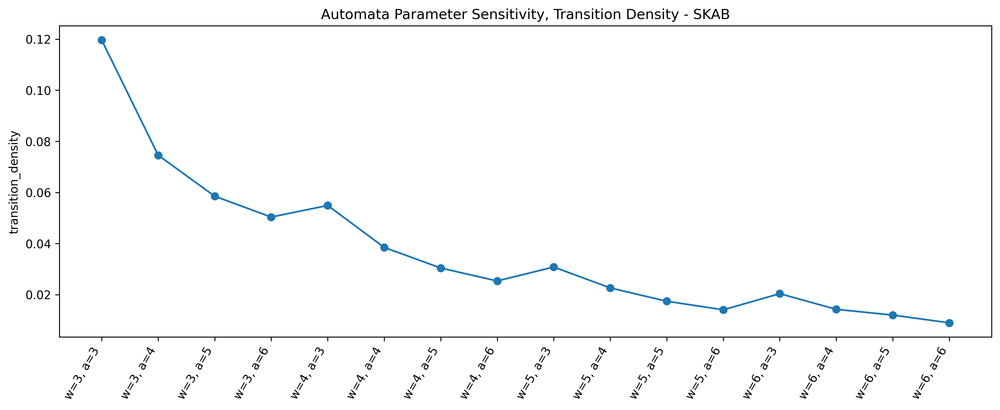

---

## 12. Proje Çıktıları

| Dosya | Açıklama |
|---|---|
| `results/dl_experiment_results.csv` | Derin öğrenme modellerinin detaylı deney sonuçları |
| `results/dl_experiment_results.json` | Derin öğrenme modellerinin detaylı deney sonuçlarının JSON formatı |
| `results/dl_experiment_summary.csv` | Derin öğrenme modellerinin ortalama ve standart sapma özetleri |
| `results/dl_experiment_summary.json` | Derin öğrenme özet sonuçlarının JSON formatı |
| `results/unseen_analysis_results.csv` | Unseen pattern analizi |
| `results/robustness_test_results.csv` | Gaussian noise robustness analizi |
| `results/cross_dataset_results.csv` | Cross-dataset genellenebilirlik sonuçları |
| `results/cross_dataset_matrix.csv` | Cross-dataset F1 matrisi |
| `results/automata_param_search.csv` | Automata parametre duyarlılık sonuçları |
| `results/runtime_summary.csv` | Eğitim ve inference süreleri |
| `results/statistical_test_results.csv` | İstatistiksel anlamlılık testleri |
| `results/*_explainability.json` | Automata açıklanabilirlik çıktıları |
| `logs/*_multiseed.csv` | Multi-seed automata deney çıktıları |

---

## 13. Projeyi Çalıştırma

### 13.1 Ana Automata Pipeline

    python main.py

Bu komut preprocessing işlemlerini ve otomata tabanlı temel pipeline'ı çalıştırır.

---

### 13.2 Tüm Deneysel Senaryolar

    python run_all_experiments.py

Bu komut multi-seed automata deneyleri, robustness testi, cross-dataset testi, parametre analizi, unseen analysis, runtime summary ve statistical test gibi deneysel senaryoları çalıştırır.

Deep learning deneyleri uzun sürdüğü için isteğe bağlı olarak ayrıca çalıştırılabilir.

---

### 13.3 Deep Learning Deneyleri

Tüm deep learning deneylerini çalıştırmak için:

    python -m src.experiments.dl_experiments

Belirli bir veri seti, model ve seed için örnek çalıştırma:

    python -c "from src.experiments.dl_experiments import DeepLearningExperimentRunner; DeepLearningExperimentRunner('configs/config.yaml').run(datasets=['skab'], models=['lstm'], seeds=[42])"

---

### 13.4 Unseen Pattern Analizi

    python -m src.experiments.unseen_analysis

---

### 13.5 İstatistiksel Testler

    python -m src.experiments.statistical_tests

---

### 13.6 Runtime Summary

    python -m src.experiments.runtime_summary

---

## 14. Sonuç

Bu proje kapsamında zaman serisi anomali tespiti problemi hem derin öğrenme tabanlı black-box modeller hem de yorumlanabilir probabilistic automata modeli ile incelenmiştir.

Sonuçlar, model performansının veri setine, veri bölme stratejisine, gürültü seviyesine, threshold seçimine ve modelleme paradigmasına bağlı olarak değiştiğini göstermektedir.

BATADAL veri setinde derin öğrenme modellerinin, özellikle 1D-CNN modelinin daha yüksek performans gösterdiği gözlemlenmiştir. SKAB veri setinde ise dosya bazlı GroupKFold ayrımı ve veri setinin yapısı nedeniyle modellerin daha düşük F1-score değerleri ürettiği görülmüştür.

Otomata tabanlı model, derin öğrenme modellerine göre her zaman en yüksek performansı üretmemiştir. Ancak transition probability, unseen pattern mapping ve step-level decision explanation sayesinde yorumlanabilirlik açısından güçlü bir avantaj sağlamıştır.

Bu çalışmanın temel amacı tek bir en iyi modeli seçmek değil, farklı modellerin farklı veri koşullarındaki davranışlarını sistematik ve açıklanabilir biçimde analiz etmektir.