# Yazılım Geliştirme Laboratuvarı-II

## From Black-Box to Explainability: Probabilistic Automata for Time Series Anomaly Detection

**Ders:** Yazılım Geliştirme Laboratuvarı-II  
**Dönem:** 2025-2026 Bahar Dönemi  

| Ad Soyad | Öğrenci No |
|---|---|
| Muhammed Ali Derindağ | 231307053 |
| İrem Kalaycı | 231307047 |

---

## İçindekiler

- [1. Projenin Amacı ve Genel Bakış](#1-projenin-amacı-ve-genel-bakış)
- [2. Çalışma Sistemi ve Mimari](#2-çalışma-sistemi-ve-mimari)
- [3. Proje Dosya Düzeni](#3-proje-dosya-düzeni)
- [4. Modüllerin Detaylı Açıklaması](#4-modüllerin-detaylı-açıklaması)
- [5. Testler ve Doğrulama](#5-testler-ve-doğrulama)
- [6. Veri Setleri](#6-veri-setleri)
- [7. Veri Ön İşleme](#7-veri-ön-işleme)
- [8. Deneysel Bölme Protokolü](#8-deneysel-bölme-protokolü)
- [9. Modelleme Yaklaşımları](#9-modelleme-yaklaşımları)
- [10. Unseen Pattern Yönetimi](#10-unseen-pattern-yönetimi)
- [11. Açıklanabilirlik Analizi](#11-açıklanabilirlik-analizi)
- [12. Deney Senaryoları](#12-deney-senaryoları)
- [13. Deney Sonuçları ve Karşılaştırmalı Analiz](#13-deney-sonuçları-ve-karşılaştırmalı-analiz)
- [14. Görsel Analizler](#14-görsel-analizler)
- [15. Proje Çıktıları](#15-proje-çıktıları)
- [16. Kurulum ve Çalıştırma](#16-kurulum-ve-çalıştırma)
- [17. Sonuç](#17-sonuç)

---

## 1. Projenin Amacı ve Genel Bakış

Bu proje, **zaman serisi verileri üzerinde anomali tespiti** problemini ele almaktadır. Çalışmanın temel amacı, yüksek performans potansiyeline sahip ancak yorumlanabilirliği sınırlı **derin öğrenme tabanlı black-box modeller** ile sembolik temsil ve durum geçişlerine dayalı **yorumlanabilir probabilistic automata tabanlı modelleri** karşılaştırmaktır.

Zaman serisi verileri finansal sistemler, endüstriyel kontrol sistemleri, IoT altyapıları, biyomedikal sinyaller ve davranışsal analiz uygulamaları gibi birçok alanda kullanılmaktadır. Bu tür verilerde anomali tespiti, sistem güvenliği ve erken uyarı mekanizmaları açısından kritik öneme sahiptir.

Proje kapsamında modeller yalnızca accuracy veya F1-score gibi performans metrikleriyle değil, aynı zamanda aşağıdaki kriterlere göre de analiz edilmiştir:

- **Genellenebilirlik** — Cross-dataset testleriyle modelin farklı veri setlerine aktarım başarısı
- **Gürültüye dayanıklılık** — Gaussian noise eklenerek robustness analizi
- **Unseen pattern davranışı** — Eğitimde görülmemiş örüntülere karşı model tepkisi
- **Açıklanabilirlik** — Otomata modelinin adım adım karar gerekçesi
- **Çalışma süresi** — Eğitim ve inference sürelerinin karşılaştırması
- **Parametre duyarlılığı** — Window size ve alphabet size etkisi
- **İstatistiksel anlamlılık** — Wilcoxon signed-rank testleri

Bu çalışmanın amacı tek bir "en iyi" modeli seçmek değil, farklı modelleme yaklaşımlarının farklı veri koşulları altında nasıl davrandığını **bilimsel ve sistematik** biçimde analiz etmektir.

---

## 2. Çalışma Sistemi ve Mimari

Proje, modüler bir Python pipeline mimarisi üzerine inşa edilmiştir. Aşağıdaki diyagram, sistemin uçtan uca çalışma akışını göstermektedir:

```
┌─────────────────────────────────────────────────────────────────────┐
│                        HAM VERİ (CSV)                              │
│                   SKAB (valve1, valve2) + BATADAL                   │
└────────────────────────────┬────────────────────────────────────────┘
                             │
                             ▼
┌─────────────────────────────────────────────────────────────────────┐
│               1. VERİ YÜKLEME (src/data/data_loader.py)            │
│  • CSV dosyalarını okuma                                           │
│  • Metadata, label ve feature ayrımı                               │
│  • Binary label standardizasyonu (0=normal, 1=anomaly)             │
└────────────────────────────┬────────────────────────────────────────┘
                             │
                             ▼
┌─────────────────────────────────────────────────────────────────────┐
│               2. VERİ BÖLME (src/data/splitter.py)                 │
│  • SKAB: GroupKFold (source_file bazlı, 5-fold)                    │
│  • BATADAL: Kronolojik split (%60 train / %20 val / %20 test)      │
└────────────────────────────┬────────────────────────────────────────┘
                             │
                             ▼
┌─────────────────────────────────────────────────────────────────────┐
│             3. ÖN İŞLEME (src/data/preprocessor.py)                │
│  • MinMax / Standard normalizasyon (SADECE train'e fit)             │
│  • PCA boyut indirgeme (SADECE train'e fit)                        │
│  • Scaler ve PCA model artifact olarak kayıt                       │
└────────────────────────────┬────────────────────────────────────────┘
                             │
                 ┌───────────┴───────────┐
                 ▼                       ▼
┌──────────────────────────┐ ┌──────────────────────────────────────┐
│   AUTOMATA PİPELİNE      │ │    DERİN ÖĞRENME PİPELİNE           │
│                          │ │                                      │
│ • PAA → SAX dönüşümü     │ │ • LSTM Autoencoder                   │
│ • Sliding window pattern  │ │ • 1D-CNN Autoencoder                 │
│ • Transition probability  │ │ • Reconstruction error tabanlı       │
│ • Anomali kararı          │ │   anomali tespiti                    │
│ • Explainability JSON     │ │ • Dynamic threshold (95th pctl)      │
└────────────┬─────────────┘ └───────────────────┬────────────────────┘
             │                                   │
             └───────────────┬───────────────────┘
                             ▼
┌─────────────────────────────────────────────────────────────────────┐
│                   DEĞERLENDİRME VE ANALİZ                          │
│  • Accuracy, Precision, Recall, F1-Score                           │
│  • Confusion Matrix, PR Curve                                      │
│  • Robustness / Cross-dataset / Parametre analizi                  │
│  • İstatistiksel testler (Wilcoxon)                                │
│  • Görselleştirme (figures/)                                       │
└─────────────────────────────────────────────────────────────────────┘
```

**Temel çalışma prensibi:** Sistem, ham zaman serisi verilerini yükler, data leakage'ı önleyecek şekilde böler ve ön işler, ardından iki farklı modelleme paradigmasıyla (automata & deep learning) anomali tespiti yapar ve sonuçları çok boyutlu olarak karşılaştırır.

---

## 3. Proje Dosya Düzeni

```
yazlab2/
├── main.py                         # Ana giriş noktası – automata pipeline'ını çalıştırır
├── run_all_experiments.py           # Tüm deneysel senaryoları orkestre eden master script
├── requirements.txt                 # Python bağımlılıkları
├── Dockerfile                       # Docker container tanımı
├── docker-compose.yml               # Docker Compose yapılandırması
├── .gitignore                       # Git izleme dışı dosya tanımları
│
├── configs/
│   └── config.yaml                  # Merkezi yapılandırma dosyası (hiperparametreler, yollar)
│
├── data/                            # Ham ve işlenmiş veri setleri
│   ├── batadal.csv                  # BATADAL Training Dataset 2
│   ├── skab/                        # SKAB veri seti
│   │   ├── valve1/                  #   valve1 klasörü (CSV dosyaları)
│   │   └── valve2/                  #   valve2 klasörü (CSV dosyaları)
│   └── processed/                   # Ön işlenmiş veriler (pipeline tarafından üretilir)
│       ├── skab/                    #   SKAB fold'ları (fold_0, fold_1, ..., fold_4)
│       │   └── fold_X/             #     train_pca.npy, val_pca.npy, test_pca.npy, labels
│       └── batadal/                 #   BATADAL işlenmiş verisi
│
├── src/                             # Kaynak kod modülleri
│   ├── __init__.py
│   ├── data/                        # Veri yükleme, bölme, ön işleme modülleri
│   │   ├── __init__.py
│   │   ├── data_loader.py           # SKAB ve BATADAL veri yükleme
│   │   ├── splitter.py              # GroupKFold ve kronolojik bölme stratejileri
│   │   ├── preprocessor.py          # Normalizasyon ve PCA boyut indirgeme
│   │   ├── build_features.py        # Uçtan uca ön işleme pipeline orkestratörü
│   │   └── dummy_generator.py       # Geliştirme/test amaçlı sentetik veri üreteci
│   │
│   ├── models/                      # Model tanımları
│   │   ├── __init__.py
│   │   ├── automata/                # Probabilistic Automata modeli
│   │   │   ├── __init__.py
│   │   │   ├── transforms.py        # PAA ve SAX dönüşümleri (z-normalizasyon dahil)
│   │   │   ├── pattern_extractor.py # Sliding window ile pattern çıkarımı
│   │   │   ├── probabilistic_automaton.py  # Geçiş olasılıkları ve unseen mapping
│   │   │   └── explainability.py    # Adım adım karar açıklaması (JSON)
│   │   │
│   │   └── dl/                      # Derin öğrenme modelleri
│   │       ├── architectures.py     # LSTM Autoencoder ve 1D-CNN Autoencoder sınıfları
│   │       ├── data_loader.py       # PyTorch Dataset/DataLoader oluşturma
│   │       ├── trainer.py           # Model eğitim döngüsü
│   │       ├── evaluate.py          # Reconstruction error hesaplama ve eşik belirleme
│   │       └── early_stopping.py    # Early stopping mekanizması
│   │
│   ├── pipelines/                   # Pipeline orkestratörleri
│   │   ├── __init__.py
│   │   └── anomaly_detection_pipeline.py  # Automata pipeline yönetimi
│   │
│   ├── experiments/                 # Deneysel senaryo modülleri
│   │   ├── runner.py                # Multi-seed deney koşturucu
│   │   ├── dl_experiments.py        # Derin öğrenme deneyleri (LSTM + CNN, multi-seed)
│   │   ├── robustness.py            # Gaussian noise robustness testi
│   │   ├── cross_dataset.py         # Cross-dataset genellenebilirlik testi
│   │   ├── param_search.py          # Automata parametre grid search
│   │   ├── unseen_analysis.py       # Unseen pattern analizi
│   │   ├── runtime_summary.py       # Eğitim/inference süre özeti
│   │   └── statistical_tests.py     # Wilcoxon signed-rank istatistiksel testler
│   │
│   ├── utils/                       # Yardımcı araçlar
│   │   ├── __init__.py
│   │   ├── config_parser.py         # YAML yapılandırma okuyucu
│   │   ├── logger.py                # Deney loglama (dosya + konsol + metrik)
│   │   └── metrics.py               # Performans metrikleri ve label hizalama
│   │
│   └── visualization/               # Görselleştirme modülleri
│       ├── visualize.py             # Confusion matrix, ROC, heatmap, state diagram
│       ├── generate_figures.py      # Toplu figür üretimi
│       ├── generate_prediction_figures.py  # Tahmin görselleştirmeleri
│       └── generate_report.py       # Otomatik rapor oluşturma
│
├── tests/                           # Birim testleri
│   └── test_unseen_management.py    # Unseen pattern yönetimi testleri
│
├── models/                          # Eğitilmiş model ağırlıkları (.pt dosyaları)
│   ├── artifacts/                   # Automata JSON modelleri, scaler/PCA pickle'ları
│   ├── best_lstm_*.pt               # LSTM Autoencoder checkpoint'ları
│   └── best_cnn_*.pt                # 1D-CNN Autoencoder checkpoint'ları
│
├── results/                         # Deney sonuçları (CSV, JSON)
│   ├── dl_experiment_results.csv    # DL deney sonuçları (detay)
│   ├── dl_experiment_summary.csv    # DL deney özeti (ortalama ± std)
│   ├── robustness_test_results.csv  # Gürültü dayanıklılık sonuçları
│   ├── cross_dataset_results.csv    # Cross-dataset sonuçları
│   ├── automata_param_search.csv    # Parametre duyarlılık analizi
│   ├── runtime_summary.csv          # Çalışma süresi karşılaştırması
│   ├── statistical_test_results.csv # İstatistiksel test sonuçları
│   ├── unseen_analysis_results.csv  # Unseen pattern analizi
│   └── *_explainability.json        # Automata açıklanabilirlik çıktıları
│
├── logs/                            # Deney logları
│   ├── automata_experiment.log      # Automata pipeline log dosyası
│   ├── data_preprocessing.log       # Ön işleme log dosyası
│   └── *_multiseed.csv              # Multi-seed automata sonuçları
│
├── figures/                         # Üretilen görseller (PNG)
│   ├── confusion_matrix_*.png       # Confusion matrix görselleri
│   ├── pr_curve_*.png               # Precision-recall eğrileri
│   ├── automata_state_diagram_*.png # Automata durum diyagramları
│   ├── transition_probability_heatmap_*.png  # Geçiş olasılığı ısı haritaları
│   ├── *_parameter_sensitivity_*.png # Parametre duyarlılık grafikleri
│   ├── model_f1_comparison.png      # Model F1 karşılaştırma grafiği
│   └── runtime_training_time_comparison.png  # Çalışma süresi karşılaştırması
│
└── Grup63_Ek_Deney_Sonuclari.pdf    # Ek deney sonuçları raporu
```

---

## 4. Modüllerin Detaylı Açıklaması

### 4.1 Veri Modülleri (`src/data/`)

| Modül | Açıklama |
|---|---|
| **`data_loader.py`** | SKAB ve BATADAL veri setlerini CSV formatından yükler. Timestamp/metadata, label ve model feature'larını ayırır. Etiketleri standart binary formata (0=normal, 1=anomaly) dönüştürür. Metadata ve hedef sütunların model girdisine sızmasını engeller. |
| **`splitter.py`** | Veri seti bazlı bölme stratejilerini uygular. SKAB için `source_file` sütunu üzerinden **GroupKFold** kullanarak aynı CSV dosyasının hem train hem test'te bulunmasını engeller. BATADAL için **kronolojik 60/20/20 bölme** uygular (rastgele satır karıştırma yapılmaz). Ayrıca SKAB'da validation seti de dosya grubu seviyesinde ayrılır. |
| **`preprocessor.py`** | İki ana bileşen içerir: **DataPreprocessor** (MinMax veya Standard normalizasyon) ve **PCADimensionalityReducer** (çok değişkenli seriyi tek boyuta indirger). Her iki bileşen de **yalnızca train verisine fit edilir** (data leakage önleme). Fit edilen scaler ve PCA nesneleri pickle olarak kaydedilir. |
| **`build_features.py`** | Yukarıdaki modülleri sıralı olarak çağıran uçtan uca ön işleme orkestratörüdür. Veri yükleme → bölme → normalizasyon → PCA → kayıt adımlarını her veri seti ve fold için yürütür. Çıktılar `data/processed/` altına `.npy` ve `.csv` olarak yazılır. |
| **`dummy_generator.py`** | Gerçek veri setleri mevcut olmadığında **geliştirme ve test amaçlı sentetik veri** üretir. Config'de `data.allow_dummy_data: true` ayarlandığında devreye girer. SKAB (valve1/valve2 yapısında CSV dosyaları) ve BATADAL (tek CSV) için gerçekçi yapıda sahte veri oluşturur. |

---

### 4.2 Model Modülleri (`src/models/`)

#### Automata Modeli (`src/models/automata/`)

| Modül | Açıklama |
|---|---|
| **`transforms.py`** | **PAA** (Piecewise Aggregate Approximation) ile zaman serisini segment ortalamaları ile kısaltır, ardından **SAX** (Symbolic Aggregate Approximation) ile z-normalizasyon ve Gaussian breakpoint'ler kullanarak sembolik string'e dönüştürür. `SAXTransformer` sınıfı bu iki adımı tek bir `transform()` çağrısında birleştirir. |
| **`pattern_extractor.py`** | SAX string üzerinde **sliding window** uygulayarak sabit uzunlukta pattern (alt-string) dizisi çıkarır. Her benzersiz pattern, otomat'ta bir **state** olarak tanımlanır. |
| **`probabilistic_automaton.py`** | **Temel automata modeli.** Eğitim pattern dizisinden state geçiş sayılarını hesaplar ve normalize ederek olasılık matrisini oluşturur: `P(S_i → S_j) = count(S_i → S_j) / total_outgoing(S_i)`. Test sırasında görülmemiş pattern'lar için **Levenshtein edit distance** ile en yakın bilinen state'e mapping yapar (deterministik tie-breaking: alfabetik sıra). Model, JSON formatında kaydedilebilir ve yüklenebilir. |
| **`explainability.py`** | Her test adımı için **JSON formatında açıklanabilirlik çıktısı** üretir. Her adım için geçiş olasılığı, önceki/mevcut state, seen/unseen durumu, mapping bilgisi, güven skoru ve anomali kararı ile birlikte doğal dilde gerekçe (`reason`) sağlar. Ayrıca path probability ve özet istatistikler hesaplar. |

#### Derin Öğrenme Modelleri (`src/models/dl/`)

| Modül | Açıklama |
|---|---|
| **`architectures.py`** | İki autoencoder mimarisi tanımlar: **LSTM Autoencoder** (encoder LSTM → latent space → decoder LSTM → reconstruction) ve **1D-CNN Autoencoder** (Conv1d + MaxPool encoder → latent space → ConvTranspose1d decoder). Her iki model de normal zaman serisi örüntülerini yeniden üretmeyi öğrenir; test sırasında yüksek reconstruction error anomali adayı olarak değerlendirilir. |
| **`data_loader.py`** | Numpy array'leri PyTorch `Dataset` ve `DataLoader` nesnelerine dönüştürür. Sliding window ile sequence'lar oluşturur. |
| **`trainer.py`** | Model eğitim döngüsünü yönetir: epoch iterasyonu, loss hesaplama, optimizer step, validation değerlendirmesi. |
| **`early_stopping.py`** | Validation loss 5 epoch boyunca iyileşmediğinde eğitimi durdurur ve en iyi checkpoint'u geri yükler. Bu sayede modeller her zaman 50 epoch tamamlamayabilir — bu beklenen davranıştır. |
| **`evaluate.py`** | Test verisinde reconstruction error hesaplar ve train reconstruction error'un 95. yüzdelik dilimine göre **dinamik threshold** belirler. Threshold üzerindeki örnekler anomali olarak işaretlenir. |

---

### 4.3 Pipeline ve Deney Modülleri

#### Pipeline (`src/pipelines/`)

| Modül | Açıklama |
|---|---|
| **`anomaly_detection_pipeline.py`** | **Automata tabanlı anomali tespiti pipeline orkestratörü.** Config yükleme, ön işleme çağırma, SAX dönüşümü, pattern çıkarımı, automata eğitimi, test değerlendirmesi ve explainability çıktısı kaydetme adımlarını uçtan uca yönetir. SKAB için fold bazlı (5-fold), BATADAL için tek split bazlı çalışır. Sonuçları `results/` dizinine yazar. |

#### Deneyler (`src/experiments/`)

| Modül | Ne Yapar | Nerede Kullanılır |
|---|---|---|
| **`runner.py`** | Multi-seed automata deneylerini çalıştırır. Her seed için pipeline'ı koşar, sonuçları toplar. | `run_all_experiments.py` → Adım 1 |
| **`dl_experiments.py`** | LSTM ve 1D-CNN modellerini her veri seti × seed × fold kombinasyonu için eğitir ve değerlendirir. Multi-seed, multi-fold DL deneyleri yürütür. | `run_all_experiments.py` → Adım 5 veya `python -m src.experiments.dl_experiments` |
| **`robustness.py`** | Automata modeline farklı standart sapmalarda (0.05, 0.1, 0.2, 0.5) Gaussian noise ekler ve performans değişimini ölçer. | `run_all_experiments.py` → Adım 2 |
| **`cross_dataset.py`** | Automata modelini bir veri setinde eğitip diğerinde test eder (SKAB→BATADAL ve BATADAL→SKAB). Genellenebilirlik analizi yapar. | `run_all_experiments.py` → Adım 3 |
| **`param_search.py`** | Window size (3-6) ve alphabet size (3-6) kombinasyonlarını grid search ile tarar. Her kombinasyon için F1, state count ve transition density raporlar. | `run_all_experiments.py` → Adım 4 |
| **`unseen_analysis.py`** | Gerçek explainability çıktılarından unseen pattern istatistikleri çıkarır: unseen oranı, mapping başarısı, ortalama edit distance, unseen anomaly oranı. | `run_all_experiments.py` → Adım 6 |
| **`runtime_summary.py`** | Tüm modellerin eğitim ve inference sürelerini toplar ve karşılaştırmalı tablo oluşturur. | `run_all_experiments.py` → Adım 7 |
| **`statistical_tests.py`** | Paired sonuçlar üzerinde **Wilcoxon signed-rank testi** uygulayarak model çiftleri arasındaki performans farklarının istatistiksel anlamlılığını değerlendirir. | `run_all_experiments.py` → Adım 8 |

---

### 4.4 Yardımcı Modüller (`src/utils/`)

| Modül | Açıklama |
|---|---|
| **`config_parser.py`** | `configs/config.yaml` dosyasını okur ve nested key erişimi sağlar (örn. `cfg.get("automata.window_size")`). Tüm hiperparametreler, yollar ve deneysel ayarlar bu dosyadan okunur. |
| **`logger.py`** | **ExperimentLogger** sınıfı üç görevi birleştirir: (1) Python `logging` ile dosya + konsol loglama, (2) seed/fold bazlı metrik kaydetme (JSON + CSV), (3) wall-clock zamanlama (`start_timer` / `stop_timer`). Tüm pipeline ve deney modülleri bu logger'ı kullanır. |
| **`metrics.py`** | İki temel fonksiyon sağlar: `map_labels_to_patterns()` — ham time-step etiketlerini SAX pattern pencerelerine hizalar (downsample), `calculate_metrics()` — Accuracy, Precision, Recall ve F1-Score hesaplar. |

---

### 4.5 Görselleştirme Modülleri (`src/visualization/`)

| Modül | Açıklama |
|---|---|
| **`visualize.py`** | Temel `Visualizer` sınıfı: dark tema estetiğiyle confusion matrix, ROC curve, transition probability heatmap, parametre duyarlılık grafiği ve automata state diyagramı (NetworkX ile) üretir. |
| **`generate_figures.py`** | Deney sonuçlarından otomatik toplu figür üretimi yapar. |
| **`generate_prediction_figures.py`** | Model tahminlerinin zaman serisi üzerinde görselleştirilmesini sağlar. |
| **`generate_report.py`** | Sonuçlardan otomatik rapor oluşturur. |

---

## 5. Testler ve Doğrulama

Proje, kritik bileşenlerin doğruluğunu sağlamak için birim testleri içermektedir. Testler `tests/` dizininde bulunur ve Python'un standart `unittest` framework'ü ile yazılmıştır.

### 5.1 `test_unseen_management.py`

Bu test dosyası, automata modelinin **unseen pattern yönetim mekanizmasını** doğrular. Dört bağımsız test senaryosu içerir:

| Test | Ne Test Eder | Neden Önemli |
|---|---|---|
| **`test_levenshtein_distance`** | `levenshtein_distance()` fonksiyonunun farklı string çiftleri (aynı string, 1 fark, tamamen farklı, farklı uzunluk, boş string) için doğru edit distance hesapladığını doğrular. | Unseen pattern mapping'in temelini oluşturan mesafe fonksiyonunun matematiksel doğruluğu, tüm downstream kararları etkiler. |
| **`test_nearest_state_mapping`** | `find_nearest_state()` metodunun unseen pattern'ları doğru state'e map ettiğini test eder. Exact match, distance-1 mapping ve **tie-breaking** (eşit mesafede birden fazla state varsa alfabetik olarak ilkini seçme) senaryolarını kapsar. | Test sırasında eğitimde görülmemiş bir pattern'la karşılaşıldığında, modelin deterministik ve tekrarlanabilir biçimde en yakın bilinen state'i seçtiğini garanti eder. |
| **`test_nearest_state_with_distance`** | `find_nearest_state_with_distance()` metodunun hem en yakın state'i hem de edit distance değerini doğru döndürdüğünü doğrular. | Explainability çıktısında raporlanan `edit_distance` değerinin güvenilirliğini sağlar. |
| **`test_nearest_state_empty_model`** | Hiç state öğrenmemiş (boş) bir modelin `find_nearest_state()` çağrısında `None` döndürdüğünü kontrol eder. | Edge case koruması — eğitim yapılmamış modelin hata vermeden güvenli şekilde davranmasını garanti eder. |
| **`test_transition_probabilities_are_normalized`** | `fit()` sonrası her kaynak state'ten çıkan geçiş olasılıklarının toplamının **1.0** olduğunu doğrular. Ayrıca belirli geçişlerin beklenen olasılık değerlerini ve bilinmeyen state'ler için 0.0 döndürüldüğünü kontrol eder. | Olasılık matrisinin matematiksel tutarlılığını garanti eder. Olasılıklar normalize değilse, anomali kararları ve explainability çıktıları yanlış olur. |

### 5.2 Testleri Çalıştırma

```bash
# Tüm testleri çalıştırma
python -m pytest tests/ -v

# Veya unittest ile
python -m unittest tests/test_unseen_management.py -v
```

---

## 6. Veri Setleri

Bu projede iki farklı zaman serisi veri seti kullanılmıştır:

### 6.1 SKAB Veri Seti

SKAB veri setinde yalnızca `valve1` ve `valve2` klasörleri kullanılmıştır. Bu iki klasörde bulunan tüm `.csv` dosyaları birleştirilerek tek bir veri seti oluşturulmuştur.

Birleştirme sırasında eklenen metadata sütunları:

| Sütun | Açıklama |
|---|---|
| `source_group` | Kaydın `valve1` veya `valve2` klasöründen geldiğini gösterir. |
| `source_file` | Kaydın hangi `.csv` dosyasından geldiğini gösterir. |

Bu sütunlar model girdisi olarak **kullanılmamıştır**. Yalnızca veri takibi, dosya bazlı veri bölme ve sonuç analizi amacıyla kullanılmıştır.

- **Hedef değişken:** `anomaly`
- **Model girdisine dahil edilmeyen sütunlar:** `datetime`, `changepoint`, `source_group`, `source_file`

### 6.2 BATADAL Veri Seti

BATADAL veri setinde yalnızca **Training Dataset 2** kullanılmıştır. Training Dataset 1 yalnızca normal operasyon verisi içerdiği için supervised sınıflandırma amacıyla kullanılmamıştır. Test Dataset ise etiket bilgisi içermediği için performans değerlendirmesinde kullanılmamıştır.

- **Hedef değişken:** `ATT_FLAG`
- Zaman bilgisini içeren sütunlar model girdisine dahil edilmemiştir.

---

## 7. Veri Ön İşleme

Veri ön işleme süreci aşağıdaki adımlardan oluşmaktadır:

1. Eksik veri kontrolü ve gerekli dönüşümler
2. Normalizasyon (MinMax veya Standard)
3. PCA ile boyut indirgeme
4. Automata modeli için PC1 bileşeninin kullanılması

Çok değişkenli zaman serileri, otomata modelinin tek boyutlu çalışması nedeniyle PCA ile tek boyuta indirgenmiştir. İlk temel bileşen olan PC1, sembolik dönüşüm ve otomata modelleme aşamalarında kullanılmıştır.

### 7.1 Data Leakage Önleme

| Kural | Uygulama |
|---|---|
| Normalizasyon yalnızca train verisine fit edilir. | Validation ve test verilerine aynı scaler uygulanmıştır. |
| PCA yalnızca train verisine fit edilir. | Validation ve test verileri aynı PCA modeliyle dönüştürülmüştür. |
| SAX/PAA sözlüğü yalnızca train verisinden oluşturulur. | Test verisi otomata geçiş olasılıklarını öğrenmek için kullanılmamıştır. |
| Otomata transition probability yalnızca train verisiyle hesaplanır. | Test verisi yalnızca değerlendirme için kullanılmıştır. |
| Random row split yapılmaz. | Zaman serisi bağımlılığı ve deney bütünlüğü korunmuştur. |

---

## 8. Deneysel Bölme Protokolü

### 8.1 SKAB Bölme Stratejisi

SKAB veri setinde satır bazlı rastgele bölme yapılmamıştır. Bunun yerine `source_file` sütunu grup değişkeni olarak kullanılmış ve **GroupKFold** uygulanmıştır. Bu sayede aynı `.csv` dosyasına ait kayıtların hem train hem test kümesinde aynı anda bulunması engellenmiştir.

| Özellik | Uygulama |
|---|---|
| Grup değişkeni | `source_file` |
| Split yöntemi | GroupKFold |
| Amaç | Aynı dosyanın train ve testte birlikte bulunmasını engellemek |
| Raporlama | Fold ortalaması ve standart sapması |

### 8.2 BATADAL Bölme Stratejisi

BATADAL veri setinde zaman sırası korunmuştur. Rastgele satır bazlı bölme yapılmamıştır.

| Split | Oran |
|---|---:|
| Train | %60 |
| Validation | %20 |
| Test | %20 |

---

## 9. Modelleme Yaklaşımları

### 9.1 Derin Öğrenme Modelleri

Projede aşağıdaki iki derin öğrenme modeli uygulanmıştır:

- **LSTM Autoencoder** — Sequence-to-sequence yapıda, LSTM encoder ile latent space'e sıkıştırma, LSTM decoder ile yeniden inşa
- **1D-CNN Autoencoder** — Conv1d katmanlarıyla temporal pattern öğrenme, ConvTranspose1d ile yeniden inşa

Bu modeller **reconstruction error** tabanlı anomali tespiti yapmaktadır. Model, normal zaman serisi örüntülerini yeniden üretmeyi öğrenir. Test aşamasında reconstruction error yüksek olan örnekler anomali adayı olarak değerlendirilir.

Dinamik threshold, train reconstruction error skorlarının 95. yüzdelik dilimine göre hesaplanmıştır.

| Parametre | Değer |
|---|---:|
| Epoch üst sınırı | 50 |
| Batch size | 32 |
| Early stopping | Validation loss |
| Patience | 5 |
| Random seed değerleri | 42, 123, 2026, 7, 999 |
| Threshold percentile | 95 |

### 9.2 Otomata Tabanlı Model

Otomata modeli aşağıdaki dönüşümler üzerinden kurulmuştur:

1. **PAA** — Piecewise Aggregate Approximation (segment ortalaması ile boyut indirgeme)
2. **SAX** — Symbolic Aggregate Approximation (z-score → sembolik string)
3. **Sliding Window** ile pattern çıkarımı (her alt-string bir state)

Her benzersiz pattern bir state olarak tanımlanmıştır. Ardışık pattern geçişlerinden transition count değerleri çıkarılmış ve normalize edilerek geçiş olasılıkları hesaplanmıştır:

```
P(S_i -> S_j) = count(S_i -> S_j) / total_outgoing_count(S_i)
```

Düşük olasılıklı geçişler anomaly adayı olarak değerlendirilmiştir.

| Parametre | Sabit Değer | Varyasyon Aralığı |
|---|---:|---|
| Window size | 4 | 3, 4, 5, 6 |
| Alphabet size | 3 | 3, 4, 5, 6 |

---

## 10. Unseen Pattern Yönetimi

Test aşamasında eğitim sırasında görülmemiş pattern değerleri ile karşılaşılması durumunda unseen pattern yönetimi uygulanmıştır.

1. Eğitim verisinden elde edilen SAX sözlüğü çıkarılır.
2. Test sırasında bu sözlükte bulunmayan pattern değerleri **unseen** olarak kabul edilir.

Unseen pattern tespit edildiğinde:

1. **Levenshtein Edit Distance** hesaplanır.
2. Testte görülen unseen pattern'a en yakın train pattern bulunur.
3. Sistem bu en yakın state üzerinden devam eder.
4. Bu işlem explainability çıktısında `mapped_to` ve `edit_distance` alanlarıyla raporlanır.

Bu mekanizma **birim testlerle doğrulanmıştır** (`tests/test_unseen_management.py`).

---

## 11. Açıklanabilirlik Analizi

Otomata tabanlı model, her test adımı için JSON formatında açıklama üretmektedir. Açıklama çıktıları modelin iç hesaplamalarıyla tutarlı olacak şekilde transition probability, confidence score ve karar gerekçesi içermektedir.

Her step için üretilen alanlar:

| Alan | Açıklama |
|---|---|
| `time_step` | Test dizisindeki adım |
| `previous_state` | Önceki resolved state |
| `state` | Mevcut resolved state |
| `pattern` | Gelen pattern |
| `status` | `seen` veya `unseen` |
| `mapped_to` | Unseen ise en yakın pattern |
| `edit_distance` | En yakın pattern ile edit distance |
| `transition` | Geçiş bilgisi |
| `probability` | Geçiş olasılığı |
| `confidence_score` | Karar güven skoru |
| `confidence_level` | `low` veya `high` |
| `path_probability_so_far` | O ana kadarki path probability |
| `threshold` | Anomali eşiği |
| `decision` | `normal` veya `anomaly` |
| `reason` | Kararın olasılıksal açıklaması |

Örnek açıklama çıktısı:

```json
{
  "time_step": 1,
  "previous_state": "cccc",
  "state": "cccc",
  "pattern": "cccc",
  "status": "seen",
  "mapped_to": null,
  "edit_distance": 0,
  "transition": {
    "from": "cccc",
    "to": "cccc",
    "probability": 0.9977
  },
  "probability": 0.9977,
  "confidence_score": 0.9977,
  "confidence_level": "high",
  "decision": "normal",
  "reason": "Transition probability is greater than or equal to the anomaly threshold."
}
```

Açıklanabilirlik çıktıları aşağıdaki dosyalarda tutulmaktadır:

- `results/skab_fold*_explainability.json`
- `results/batadal_fold0_explainability.json`

---

## 12. Deney Senaryoları

Deneyler üç ana senaryo altında yürütülmüştür:

| Senaryo | Açıklama |
|---|---|
| Orijinal veri | Modeller orijinal test verisi üzerinde değerlendirilmiştir. |
| Gaussian noise | Veriye farklı standart sapmalarda Gaussian noise eklenerek robustness analizi yapılmıştır. |
| Unseen veri | Eğitim SAX sözlüğünde bulunmayan test pattern değerleri analiz edilmiştir. |

Gaussian noise deneylerinde kullanılan standart sapma değerleri: **0.05, 0.1, 0.2, 0.5**

---

## 13. Deney Sonuçları ve Karşılaştırmalı Analiz

### 13.1 Model Performansı ve Stabilitesi

| Dataset | Model | Accuracy Mean | Accuracy Std | F1 Mean | F1 Std |
|---|---|---:|---:|---:|---:|
| BATADAL | 1D-CNN | 0.7512 | 0.0167 | 0.5191 | 0.0553 |
| BATADAL | LSTM | 0.6293 | 0.0038 | 0.0447 | 0.0142 |
| BATADAL | Automata | 0.8354 | 0.0000 | 0.2703 | 0.0000 |
| SKAB | 1D-CNN | 0.5425 | 0.0173 | 0.1019 | 0.1438 |
| SKAB | LSTM | 0.5270 | 0.0611 | 0.1455 | 0.1721 |
| SKAB | Automata | 0.6310 | 0.0000 | 0.0236 | 0.0000 |

BATADAL veri setinde en yüksek F1-score değeri **1D-CNN** modeli tarafından elde edilmiştir. SKAB veri setinde ise **LSTM** modeli daha yüksek F1-score üretmiştir.

---

### 13.2 Gürültü Etkisi Analizi

| Dataset | Original F1 | Noise 0.05 F1 | Noise 0.1 F1 | Noise 0.2 F1 | Noise 0.5 F1 |
|---|---:|---:|---:|---:|---:|
| SKAB | 0.0236 | 0.0689 | 0.1267 | 0.1979 | 0.3059 |
| BATADAL | 0.2703 | 0.2778 | 0.2778 | 0.4186 | 0.3043 |

---

### 13.3 Unseen Veri Davranışı

| Dataset | Fold | Total Steps | Unseen Count | Unseen Rate | Mapped Unseen Rate | Mean Edit Distance | Unseen Anomaly Rate |
|---|---:|---:|---:|---:|---:|---:|---:|
| BATADAL | 0 | 164 | 0 | 0.0000 | 0.0000 | 0.0000 | 0.0000 |
| SKAB | 0 | 899 | 1 | 0.0011 | 1.0000 | 1.0000 | 1.0000 |
| SKAB | 1 | 895 | 0 | 0.0000 | 0.0000 | 0.0000 | 0.0000 |
| SKAB | 2 | 895 | 2 | 0.0022 | 1.0000 | 1.0000 | 1.0000 |
| SKAB | 3 | 883 | 3 | 0.0034 | 1.0000 | 1.0000 | 0.6667 |
| SKAB | 4 | 905 | 6 | 0.0066 | 1.0000 | 1.0000 | 0.3333 |

Tüm unseen pattern'ların Levenshtein edit distance kullanılarak en yakın state'e **başarıyla map edildiği** görülmektedir (`mapped_unseen_rate = 1.0`).

---

### 13.4 Cross-Dataset Genellenebilirlik

| Train Dataset | Test Dataset | Accuracy | Precision | Recall | F1 |
|---|---|---:|---:|---:|---:|
| SKAB | SKAB | 0.6301 | 0.3333 | 0.0104 | 0.0201 |
| SKAB | BATADAL | 0.3963 | 0.1275 | 0.5652 | 0.2080 |
| BATADAL | SKAB | 0.3713 | 0.3668 | 0.9836 | 0.5343 |
| BATADAL | BATADAL | 0.8354 | 0.3571 | 0.2174 | 0.2703 |

---

### 13.5 Automata Parametre Duyarlılık Analizi

#### SKAB

| Window Size | Alphabet Size | Accuracy | F1 | State Count | Transition Density |
|---:|---:|---:|---:|---:|---:|
| 3 | 3 | 0.6356 | 0.0192 | 15.6 | 0.1197 |
| 4 | 3 | 0.6310 | 0.0236 | 29.2 | 0.0549 |
| 4 | 6 | 0.5819 | 0.1599 | 64.4 | 0.0253 |
| 5 | 6 | 0.5783 | 0.1703 | 103.0 | 0.0141 |
| 6 | 6 | 0.5729 | 0.1774 | 146.6 | 0.0090 |

#### BATADAL

| Window Size | Alphabet Size | Accuracy | F1 | State Count | Transition Density |
|---:|---:|---:|---:|---:|---:|
| 3 | 3 | 0.8727 | 0.0000 | 26.0 | 0.1006 |
| 4 | 3 | 0.8354 | 0.2703 | 68.0 | 0.0279 |
| 4 | 6 | 0.5183 | 0.3009 | 316.0 | 0.0042 |
| 5 | 5 | 0.4908 | 0.2655 | 364.0 | 0.0033 |
| 6 | 6 | 0.4136 | 0.2857 | 470.0 | 0.0022 |

---

### 13.6 Runtime Karşılaştırması

| Dataset | Model | Training Time Mean (s) | Training Time Std | Inference Time Mean (s) | Accuracy | F1 |
|---|---|---:|---:|---:|---:|---:|
| SKAB | Automata | 0.90 | 0.00 | 0.00 | 0.6310 | 0.0236 |
| BATADAL | Automata | 0.10 | 0.00 | 0.00 | 0.8354 | 0.2703 |
| BATADAL | 1D-CNN | 13.06 | 0.21 | 0.27 | 0.7512 | 0.5191 |
| BATADAL | LSTM | 40.11 | 1.84 | 0.94 | 0.6293 | 0.0447 |
| SKAB | 1D-CNN | 63.49 | 12.85 | 1.46 | 0.5425 | 0.1019 |
| SKAB | LSTM | 171.77 | 35.83 | 5.34 | 0.5270 | 0.1455 |

Automata modeli, derin öğrenme modellerine göre **~100-1400x daha hızlı** eğitim süresine sahiptir.

---

### 13.7 İstatistiksel Anlamlılık Testleri

| Dataset | Model A | Model B | N Pairs | Statistic | P-value | Significant (α=0.05) |
|---|---|---|---:|---:|---:|---|
| SKAB | LSTM | 1D-CNN | 25 | 64.0 | 0.3491 | Hayır |
| SKAB | Automata | 1D-CNN | 5 | 0.0 | 0.0625 | Hayır |
| SKAB | Automata | LSTM | 5 | 0.0 | 0.0625 | Hayır |
| BATADAL | LSTM | 1D-CNN | 5 | 0.0 | 0.0625 | Hayır |
| BATADAL | Automata | 1D-CNN | 5 | 0.0 | 0.0625 | Hayır |
| BATADAL | Automata | LSTM | 5 | 0.0 | 0.0625 | Hayır |

---

## 14. Görsel Analizler

### 14.1 Confusion Matrix

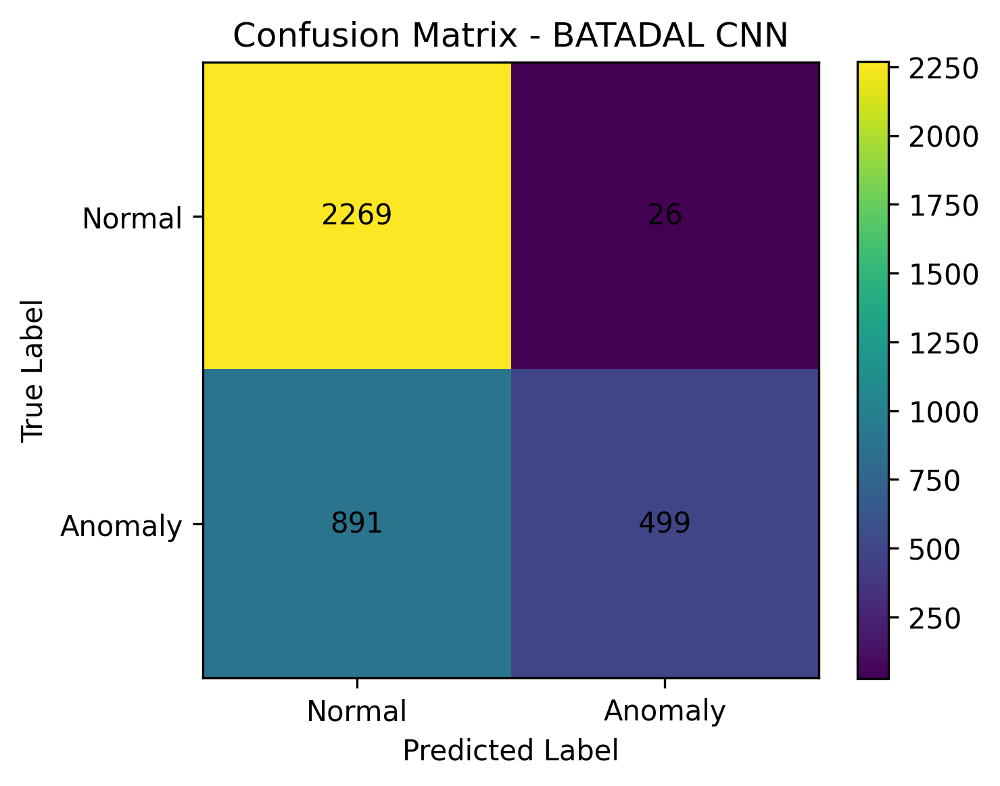

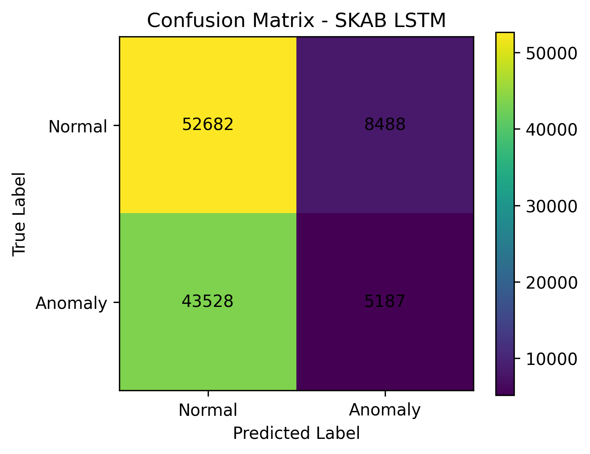

### 14.2 Precision-Recall Eğrisi

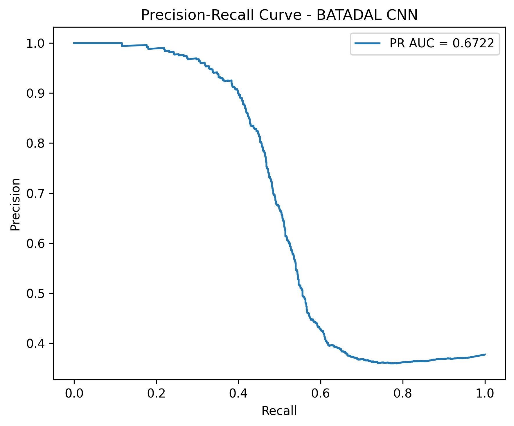

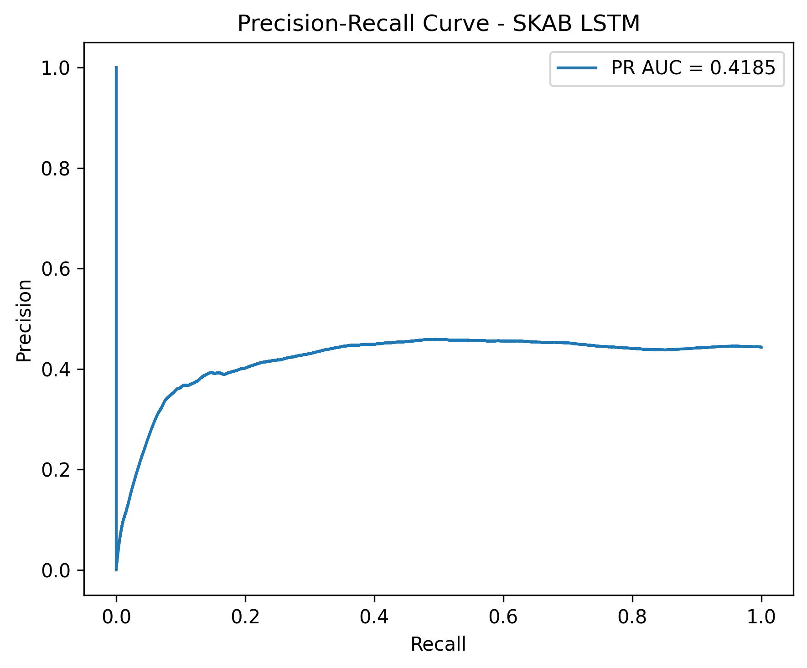

### 14.3 Automata State Diagram

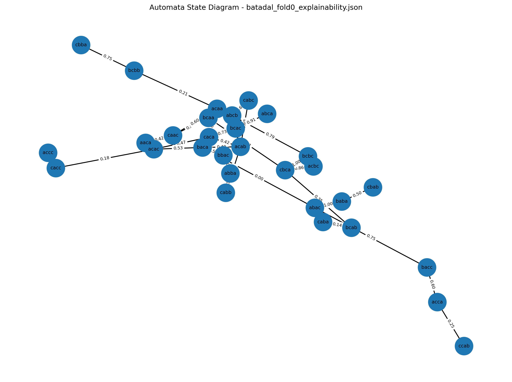

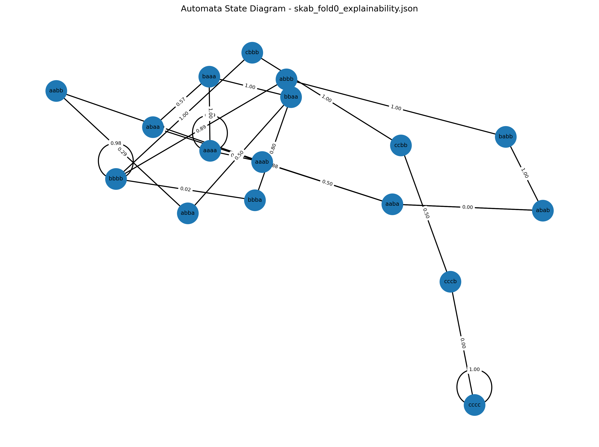

### 14.4 Transition Probability Heatmap

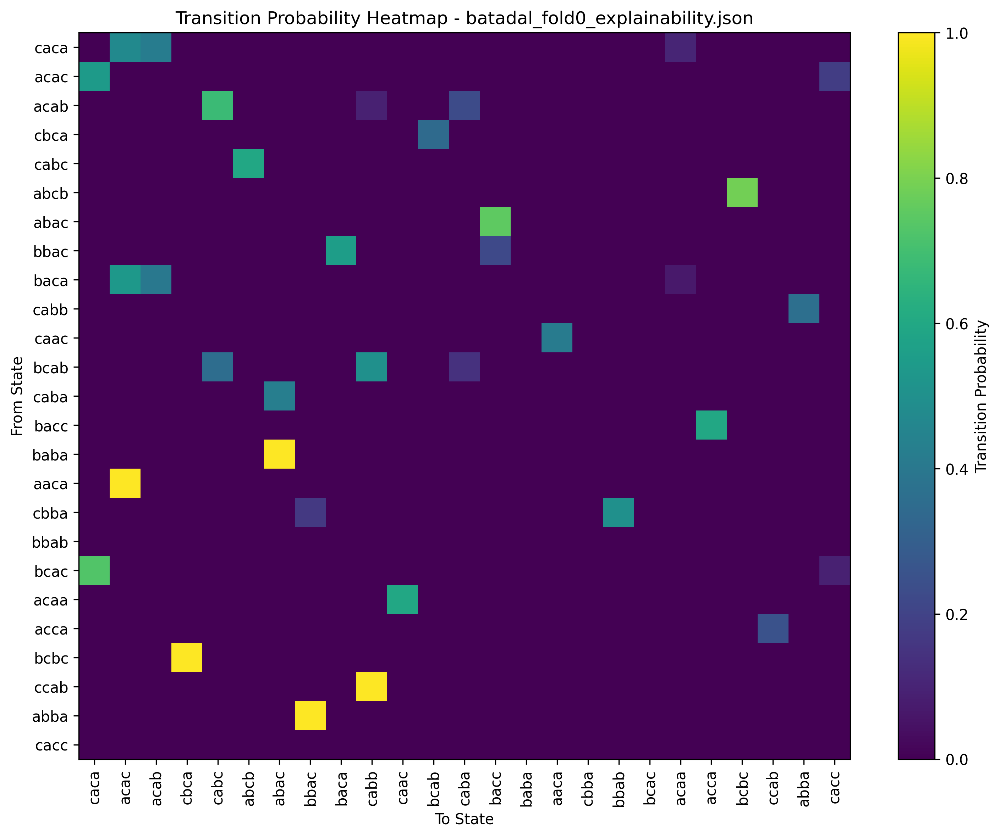

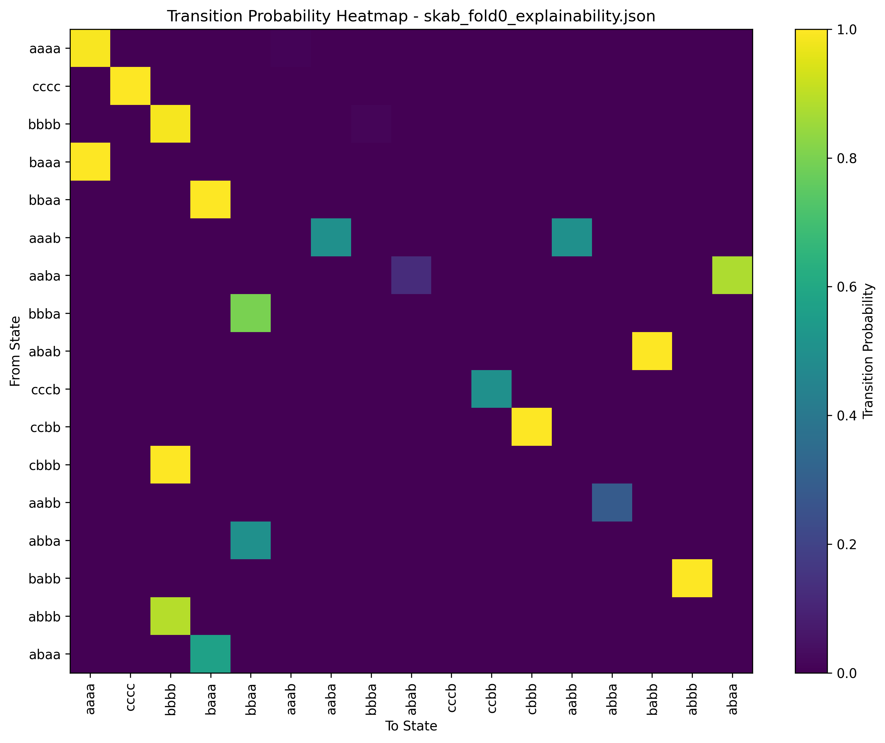

### 14.5 Parametre Duyarlılık Grafikleri

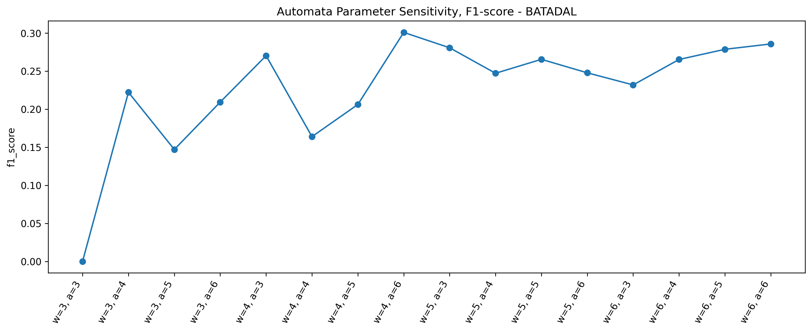

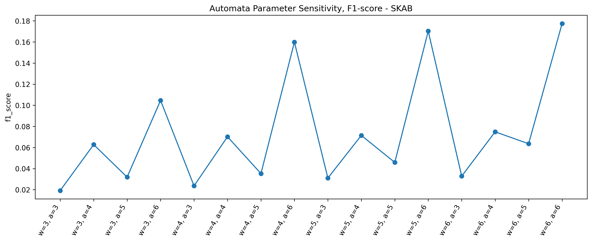

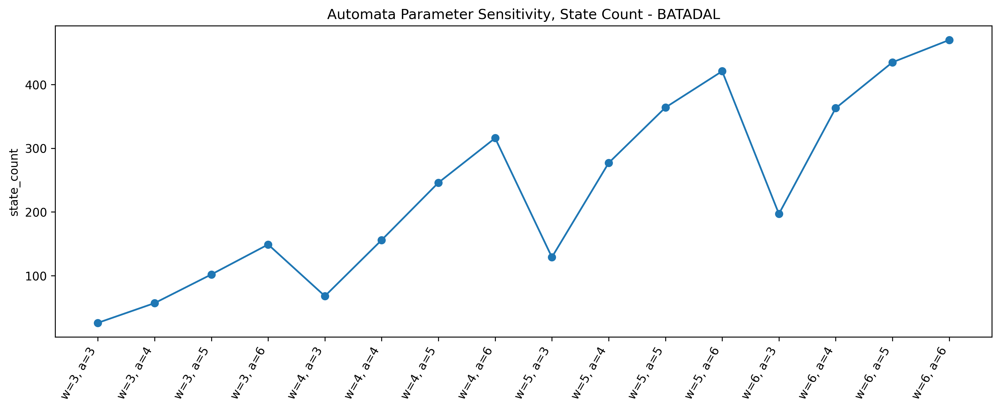

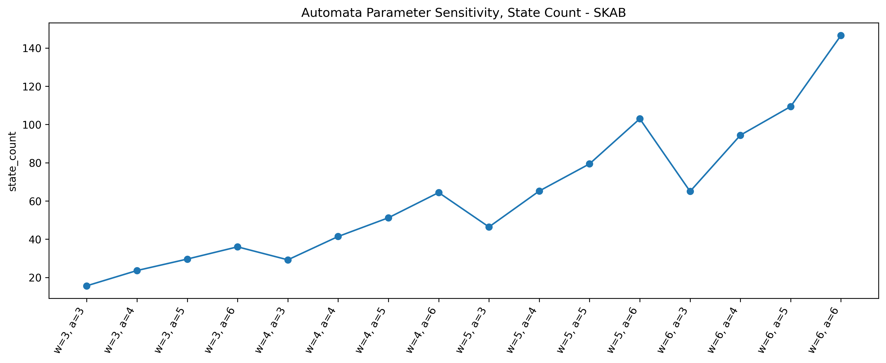

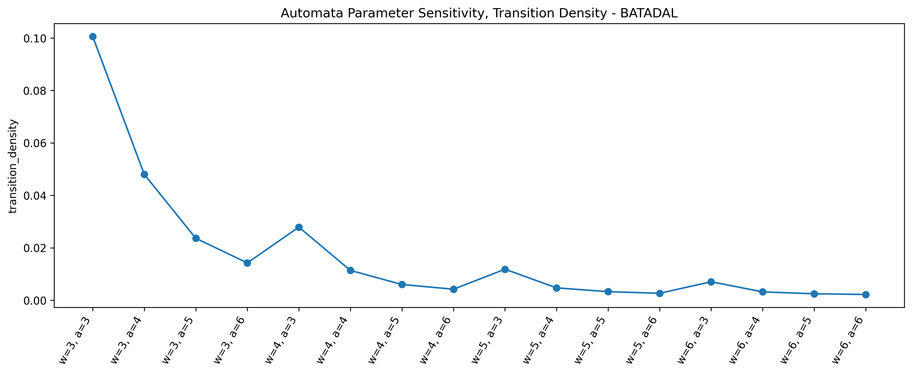

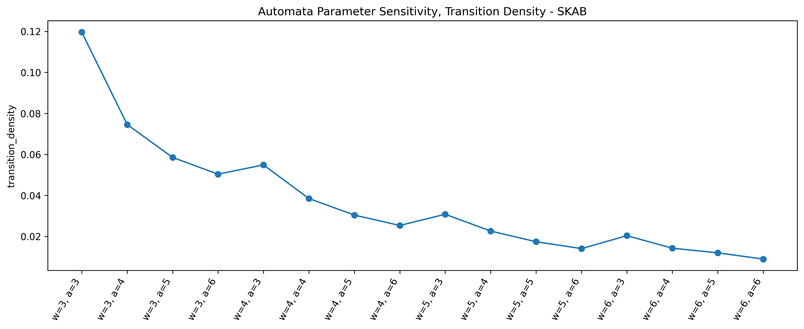

---

## 15. Proje Çıktıları

| Dosya | Açıklama |
|---|---|
| `results/dl_experiment_results.csv` | Derin öğrenme modellerinin detaylı deney sonuçları |
| `results/dl_experiment_results.json` | Derin öğrenme modellerinin detaylı deney sonuçlarının JSON formatı |
| `results/dl_experiment_summary.csv` | Derin öğrenme modellerinin ortalama ve standart sapma özetleri |
| `results/dl_experiment_summary.json` | Derin öğrenme özet sonuçlarının JSON formatı |
| `results/unseen_analysis_results.csv` | Unseen pattern analizi |
| `results/robustness_test_results.csv` | Gaussian noise robustness analizi |
| `results/cross_dataset_results.csv` | Cross-dataset genellenebilirlik sonuçları |
| `results/cross_dataset_matrix.csv` | Cross-dataset F1 matrisi |
| `results/automata_param_search.csv` | Automata parametre duyarlılık sonuçları |
| `results/runtime_summary.csv` | Eğitim ve inference süreleri |
| `results/statistical_test_results.csv` | İstatistiksel anlamlılık testleri |
| `results/*_explainability.json` | Automata açıklanabilirlik çıktıları |
| `logs/*_multiseed.csv` | Multi-seed automata deney çıktıları |
| `Grup63_Ek_Deney_Sonuclari.pdf` | Deney sonuçları ve karşılaştırmalı analiz tablolarını içeren ek PDF raporu |

---

## 16. Kurulum ve Çalıştırma

### 16.1 Gereksinimler

| Bağımlılık | Minimum Versiyon |
|---|---|
| Python | 3.10+ |
| pandas | ≥ 2.0.0 |
| numpy | ≥ 1.24.0 |
| scikit-learn | ≥ 1.3.0 |
| scipy | ≥ 1.10.0 |
| torch (PyTorch) | ≥ 2.0.0 |
| pyyaml | ≥ 6.0 |
| matplotlib | ≥ 3.7.0 |
| tqdm | ≥ 4.65.0 |

### 16.2 Kurulum

```bash
# Depo klonlama
git clone <repo-url>
cd yazlab2

# Bağımlılıkları yükleme
pip install -r requirements.txt
```

### 16.3 Veri Setlerini Yerleştirme

```
data/
├── batadal.csv              # BATADAL Training Dataset 2 CSV dosyası
└── skab/
    ├── valve1/              # SKAB valve1 CSV dosyaları
    │   ├── 0.csv
    │   ├── 1.csv
    │   └── ...
    └── valve2/              # SKAB valve2 CSV dosyaları
        ├── 0.csv
        ├── 1.csv
        └── ...
```

> **Not:** Gerçek veri setleri olmadan geliştirme yapmak için `configs/config.yaml` dosyasında `data.allow_dummy_data: true` ayarını yapabilirsiniz. Bu durumda sentetik veri otomatik üretilir.

### 16.4 Ana Automata Pipeline

```bash
python main.py
```

Bu komut ön işleme ve automata tabanlı temel pipeline'ı çalıştırır (SKAB + BATADAL).

### 16.5 Tüm Deneysel Senaryolar

```bash
python run_all_experiments.py
```

Bu komut sırasıyla aşağıdaki adımları çalıştırır:
1. Multi-seed automata deneyleri (SKAB + BATADAL)
2. Gaussian noise robustness testi
3. Cross-dataset genellenebilirlik testi
4. Automata parametre grid search
5. *(isteğe bağlı)* Deep learning deneyleri
6. Unseen pattern analizi
7. Runtime summary üretimi
8. İstatistiksel anlamlılık testleri

**Belirli Bir Testi Çalıştırma:**
Sunumlar veya özel analizler için sadece belirli bir testi çalıştırmak isterseniz `--test` parametresini kullanabilirsiniz:

```bash
python run_all_experiments.py --test robustness
```

Kabul edilen parametreler ve işlevleri:
- `all` : Tüm deneysel senaryoları sırayla çalıştırır (Varsayılan).
- `multiseed` : SKAB ve BATADAL veri setleri için çoklu-tohum (multi-seed) automata testlerini koşar.
- `robustness` : Modelin gürültüye karşı dayanıklılığını ölçmek için veriye Gaussian noise ekleyerek testi tekrarlar.
- `cross_dataset` : Modeli bir veri setinde eğitip diğerinde test ederek genellenebilirliği (cross-dataset transferi) ölçer.
- `param_search` : Automata modeli için farklı window size ve alphabet size kombinasyonlarını dener (Grid Search).
- `dl` : Derin öğrenme (LSTM ve 1D-CNN) modellerinin eğitimini ve testini başlatır.
- `unseen` : Eğitim setinde bulunmayan (unseen) örüntülerin model tarafından nasıl çözümlendiğini analiz eder.
- `runtime` : Çalıştırılan modellerin eğitim ve tahmin (inference) sürelerini karşılaştırmalı olarak raporlar.
- `statistics` : Model performansları arasındaki farkların istatistiksel olarak anlamlı olup olmadığını Wilcoxon Signed-Rank testi ile hesaplar.
- `figures` : `results/` dizinindeki mevcut .csv ve .json dosyalarını okuyarak tüm grafikleri `figures/<tarih_saat>/` klasörüne otomatik üretir.

### 16.6 Deep Learning Deneyleri

Deep learning deneyleri uzun sürdüğü için varsayılan olarak atlanır. Çalıştırma seçenekleri:

```bash
# Tam DL deneyleri (tüm veri setleri × modeller × seed'ler — uzun sürer)
python run_all_experiments.py --include-dl

# Hızlı DL doğrulama testi (tek veri seti, tek model, tek seed)
python run_all_experiments.py --dl-smoke-test

# Bağımsız DL deney çalıştırma
python -m src.experiments.dl_experiments

# Belirli veri seti, model ve seed ile
python -c "from src.experiments.dl_experiments import DeepLearningExperimentRunner; DeepLearningExperimentRunner('configs/config.yaml').run(datasets=['skab'], models=['lstm'], seeds=[42])"
```

### 16.7 Bireysel Deney Modülleri

```bash
# Unseen pattern analizi
python -m src.experiments.unseen_analysis

# İstatistiksel testler
python -m src.experiments.statistical_tests

# Runtime özeti
python -m src.experiments.runtime_summary
```

### 16.8 Birim Testleri

```bash
python -m pytest tests/ -v
```

### 16.9 Docker ile Çalıştırma

Projeyi sisteminize Python kurmadan, tamamen izole bir Docker ortamında çalıştırmak için aşağıdaki komutları kullanabilirsiniz:

```bash
# Sadece veri ön işleme ve temel automata modelini çalıştırmak için
docker-compose run --rm anomaly-detection python main.py

# Tüm deneysel senaryoları sırayla çalıştırmak için
docker-compose run --rm anomaly-detection python run_all_experiments.py

# Tüm deneysel senaryoları derin öğrenme (DL) testleri dahil çalıştırmak için
docker-compose run --rm anomaly-detection python run_all_experiments.py --include-dl

# SADECE spesifik bir testi çalıştırmak için (Örn: Gürültü/Robustness testi)
docker-compose run --rm anomaly-detection python run_all_experiments.py --test robustness

# SADECE Deep Learning testlerini çalıştırmak için
docker-compose run --rm anomaly-detection python run_all_experiments.py --test dl

# SADECE mevcut sonuçlardan Grafikleri (Figures) üretmek için
docker-compose run --rm anomaly-detection python run_all_experiments.py --test figures
```

**Not:** Bu komutlardaki `--rm` parametresi, işlem bittikten sonra kullanılan geçici container'ı otomatik olarak silerek sisteminizde gereksiz yer kaplamasını önler. Çıktılar otomatik olarak bilgisayarınızdaki `results/` ve `logs/` klasörlerine kaydedilecektir.

---

## 17. Sonuç

Bu proje kapsamında zaman serisi anomali tespiti problemi hem derin öğrenme tabanlı black-box modeller hem de yorumlanabilir probabilistic automata modeli ile incelenmiştir.

Sonuçlar, model performansının **veri setine, veri bölme stratejisine, gürültü seviyesine, threshold seçimine ve modelleme paradigmasına** bağlı olarak değiştiğini göstermektedir.

BATADAL veri setinde derin öğrenme modellerinin, özellikle 1D-CNN modelinin daha yüksek performans gösterdiği gözlemlenmiştir. SKAB veri setinde ise dosya bazlı GroupKFold ayrımı ve veri setinin yapısı nedeniyle modellerin daha düşük F1-score değerleri ürettiği görülmüştür.

Otomata tabanlı model, derin öğrenme modellerine göre her zaman en yüksek performansı üretmemiştir. Ancak **transition probability, unseen pattern mapping ve step-level decision explanation** sayesinde yorumlanabilirlik açısından güçlü bir avantaj sağlamıştır. Ayrıca eğitim süresi açısından derin öğrenme modellerine göre çok daha verimlidir.

Bu çalışmanın temel amacı tek bir en iyi modeli seçmek değil, farklı modellerin farklı veri koşullarındaki davranışlarını **sistematik ve açıklanabilir** biçimde analiz etmektir.
